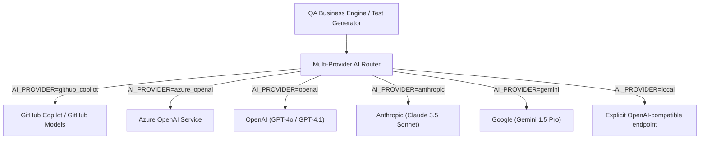

# AI-QA-Engine · Multi-Provider AI Configuration Strategy

## 1. Provider Abstraction Architecture

The AI-QA-Engine decouples business logic from specific AI provider implementations via a unified provider abstraction layer. Select one explicit provider per environment: GitHub Copilot / GitHub Models, Azure OpenAI, OpenAI, Anthropic, Gemini, or an explicitly configured OpenAI-compatible local endpoint.



---

## 2. Standard Environment Variables

All AI provider settings are configured via standard environment variables:

```bash
# Provider Selection: github_copilot, openai, azure_openai, anthropic, gemini, local
AI_PROVIDER=github_copilot

# Model Identifier (e.g. gpt-4o, gpt-4o-mini, o1, o3-mini, Phi-3.5-mini-instruct)
AI_MODEL=gpt-4o

# API Credentials for GitHub Copilot / GitHub Models
GITHUB_TOKEN=ghp_your_github_token_here

# API Base Endpoint / URL
AI_ENDPOINT=https://models.inference.ai.azure.com

# Inference Parameters
AI_TEMPERATURE=0.2
AI_MAX_TOKENS=4096
AI_TIMEOUT_SECONDS=45
```

---

## 3. Provider Configuration Examples

### A. GitHub Copilot / GitHub Models (Recommended)
```bash
AI_PROVIDER=github_copilot
AI_MODEL=gpt-4o
AI_ENDPOINT=https://models.inference.ai.azure.com
GITHUB_TOKEN=ghp_... (or github_pat_...)
```

### B. Azure OpenAI Service
```bash
AI_PROVIDER=azure_openai
AI_MODEL=gpt-4o
AI_ENDPOINT=https://your-resource.openai.azure.com/openai/deployments/your-deployment/chat/completions?api-version=2024-02-15-preview
AI_API_KEY=your-azure-key
```

### C. Direct OpenAI API
```bash
AI_PROVIDER=openai
AI_MODEL=gpt-4o
AI_ENDPOINT=https://api.openai.com/v1
OPENAI_API_KEY=sk-...
```

### D. Explicit OpenAI-compatible local endpoint
```bash
AI_PROVIDER=local
AI_MODEL=your-model
AI_ENDPOINT=http://127.0.0.1:8080/v1
AI_API_KEY=your-token-if-required
```
