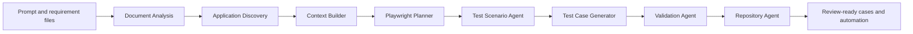

# AI Test Design Studio

**Status:** Implemented pilot workflow

AI Test Design Studio turns a prompt and optional requirement documents into review-ready test cases and executable automation definitions. The workflow is application-aware: it includes the selected application's platform and target, bounded document context, existing reference cases, requested coverage categories, step limits, and provider configuration.

## Workflow

The backend persists stage status, progress, detail, timestamps, and metrics in the durable `AIGenerationJob.result` JSON. The frontend polls that job and renders the same server-owned state beside the generation console. Each job also records `workflow_version` and an `agent_definitions` manifest containing the source path, version, and checksum of the definition files available at job creation.

The current implementation is a server-orchestrated pipeline. Application Discovery uses bounded HTTP/Playwright inspection plus a safe exploratory pass over same-origin navigation, tabs, menus, filters, and disclosure controls, then persists observations and hypotheses before context construction. The AI Planner makes a structured provider call that produces exploratory charters, followed by one or more structured Generator calls in batches. Continuation prompts include already-generated titles and the bounded exploratory context so a short first response does not silently cap the suite. Document analysis, context building, scenario metadata, validation, and repository persistence remain explicit deterministic orchestration boundaries. Per-agent routing, budgets, and retry policies remain future hardening work.

## Agent Responsibilities

| Stage | Responsibility | Persisted output |
| --- | --- | --- |
| Document Analysis | Extract requirement, feature, rule, workflow, and risk signals. | Document metrics and bounded context |
| Application Discovery | Inspect authorized target pages and perform bounded safe exploratory interactions. | Discovery snapshot, exploratory observations/hypotheses, and metrics |
| Context Builder | Combine application, document, reference-case, prompt, and exploratory signals. | Application context snapshot |
| Playwright Planner | Make a structured AI planning call that defines entry points, exploratory charters, coverage boundaries, risk, and exit criteria. | Planner snapshot, charters, and provider provenance |
| Test Scenario Agent | Select positive, negative, boundary, edge, exploratory, security, accessibility, API, and performance categories. | Scenario plan with safe exploratory charters and performance budget context |
| Test Case Generator | Use the AI plan and exploratory charters to request and parse structured cases in continuation batches. | Candidate count, target count, exploratory coverage, call count, and generation metadata |
| Validation Agent | Check duplicates, required fields, and step bounds. | Coverage score and issue counts |
| Repository Agent | Persist cases and compile automation definitions. | Case identifiers and review counts |

The operational agent definitions live under `.github/agents/`. The planner and generator definitions retain their browser-specific guidance, while the document, context, scenario, validation, and repository definitions describe the responsibilities represented by the durable stages.

### API and performance coverage

The generator accepts `input_format: "openapi"` for API contracts and `input_format: "performance_requirements"` for non-functional requirements. The API coverage option produces source-grounded cases for endpoints, methods, authentication, request data, status codes, response schemas, and negative responses. The performance coverage option produces bounded scenarios with workload assumptions, measurement methods, latency/throughput/error-rate criteria, and an optional `performance_budget`. These cases describe test design and acceptance criteria; they do not send load or mutate the target application.

## Request Contract

`POST /api/v1/ai-generation/jobs?application_id={id}` accepts the existing prompt and generation settings plus:

- `document_context`: bounded extracted context, at most 60,000 characters.
- `document_names`: source filenames for result traceability.
- Existing step bounds and coverage flags, including `include_api_validations` and `include_performance_scenarios`.
- `input_format`: `text`, `user_story`, `acceptance_criteria`, `brd`, `csv`, `excel`, `openapi`, `db_schema`, or `performance_requirements`.
- `performance_budget`: optional measurable target such as a p95 latency, throughput, concurrency, or error-rate objective.
- Provider and model overrides resolved against the authenticated configuration.

The request still works without documents. In that case the provider receives the prompt, application context, target snapshot, and available reference cases with an explicit no-document marker.

## Result Contract

A completed job includes:

- `summary`, generation mode, provider, and persisted case IDs.
- `planner_used`, planner provider/model, planner case target, and generator call count.
- `discovery`, `application_context`, `planner`, `scenario_plan`, and `validation` snapshots.
- `discovery` includes bounded exploratory observations, hypotheses, and authenticated-snapshot provenance when available.
- `planner` and `scenario_plan` include exploratory charters and safe-action boundaries.
- `document_names` when documents were used.
- `agent_stages`, where each stage contains `key`, `name`, `status`, `progress`, `detail`, timestamps, and metrics.
- `workflow_version` and `agent_definitions` for provenance.

A failed job retains the completed stage history and marks the active stage as failed. Raw uploaded document bytes are not stored in the job result or written to the console. Only bounded derived context and metrics are passed downstream.

## Security and Governance Boundaries

- All document and job endpoints require an authenticated tester, QA lead, or admin role.
- Uploads are limited to eight files per request and 10 MB per file.
- Filenames are reduced to their basename before analysis.
- Context passed to the provider is capped at 60,000 characters.
- Provider configuration and credentials remain in the existing settings and secret-resolution boundary.
- Existing drafts are only replaced when the explicit replacement option is enabled.
- Generated cases remain draft/review-oriented and should be reviewed before business-critical execution. API and performance cases must be routed to an API or load-test runner after review; the current browser runner does not execute those non-UI protocols.

This workflow does not yet provide tenant quotas, per-user rate limits, object-storage retention, independent per-agent routing/budgets, or a requirement-to-test traceability graph. Those remain enterprise hardening work described in [ENTERPRISE_MODERNIZATION_REPORT.md](ENTERPRISE_MODERNIZATION_REPORT.md).

## Source Modules

- [Frontend AI Generator](../frontend/src/app/page.tsx)
- [Frontend domain types](../frontend/src/types/index.ts)
- [Generation job API](../backend/app/api/v1/ai_generation.py)
- [Durable job worker](../backend/app/services/ai_generation_jobs.py)
- [Stage metadata helpers](../backend/app/services/ai_generation_pipeline.py)
- [Document parser](../backend/app/services/document_analysis.py)
- [Application discovery and target context](../backend/app/services/ai_service.py)
- [Provider and prompt service](../backend/app/services/ai_service.py)
