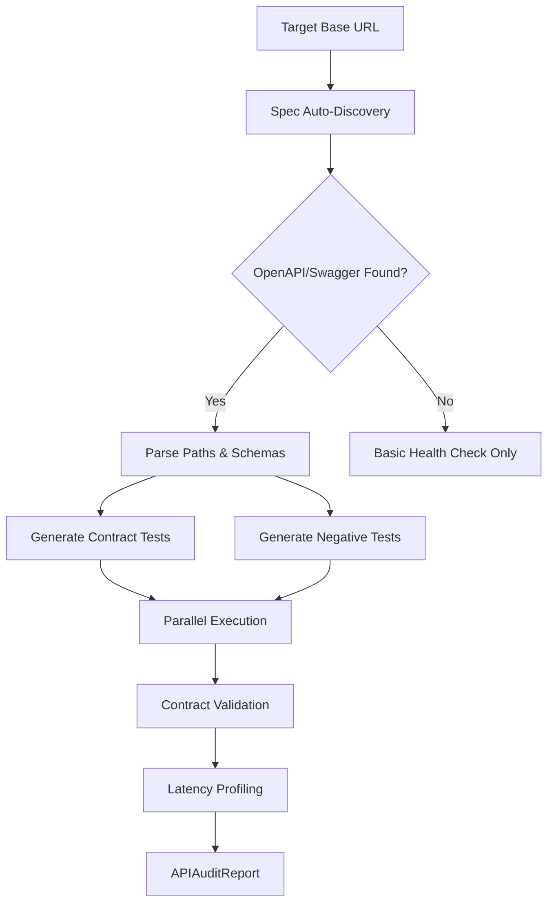

# SkyWatch API Testing Agent

> Autonomous REST API contract validation, negative testing, and performance profiling agent.

## Architecture



## Capabilities

### 1. OpenAPI/Swagger Auto-Discovery
The agent probes standard spec locations to automatically discover API contracts:
- `/openapi.json`
- `/swagger.json`
- `/api/v1/openapi.json`
- `/docs/openapi.json`
- `/api-docs`
- `/api/swagger.json`

### 2. Contract Validation
For each discovered endpoint, the agent validates:
- **Status codes**: Response matches expected success code (200, 201, 204, etc.)
- **Content-Type**: Response content-type matches declared media type
- **Schema**: Response body fields match declared types and required constraints

### 3. Negative & Boundary Testing
Auto-generates adversarial payloads for POST/PUT/PATCH endpoints:

| Type | Payloads |
|---|---|
| `string` | `""`, `null`, `12345`, `true`, `"x" * 10001`, XSS vector, SQL injection |
| `integer` | `null`, `""`, `"abc"`, `99999999999`, `-1`, `0`, `2.5` |
| `number` | `null`, `""`, `"nan"`, `Infinity`, `-99999.99` |
| `boolean` | `null`, `""`, `"maybe"`, `0`, `1`, `"yes"` |
| `array` | `null`, `""`, `{}`, `"not_an_array"`, `[]` |
| `object` | `null`, `""`, `[]`, `"not_an_object"`, `42` |

Tests include:
- **Missing required fields**: Omit each required property individually
- **Type mismatch**: Send invalid types for typed properties

### 4. Response Time Profiling
Tracks latency for every request and computes:
- **Average** response time
- **P50** (median) latency
- **P90** latency (90th percentile)
- **P99** latency (99th percentile)

### 5. Authentication Support
Supports three authentication modes:
- **Bearer token**: `Authorization: Bearer <token>`
- **API key header**: Custom header name/prefix
- **OAuth2 token exchange**: Via pre-configured token

## API Endpoints

### On-Demand API Audit
```
POST /api/v1/orchestrator/api-audit
```

**Request Body:**
```json
{
  "base_url": "https://api.example.com",
  "auth_token": "your-bearer-token",
  "spec_url": "https://api.example.com/openapi.json"
}
```

**Response:**
```json
{
  "base_url": "https://api.example.com",
  "total_tests": 15,
  "passed": 12,
  "failed": 2,
  "errors": 1,
  "contract_violations": 3,
  "avg_response_time_ms": 45.2,
  "p50_response_time_ms": 38.0,
  "p90_response_time_ms": 95.0,
  "p99_response_time_ms": 180.0,
  "discovered_endpoints": 8,
  "duration_seconds": 3.45,
  "results": [...]
}
```

### Campaign Integration
Enable API testing in campaign launches:
```json
{
  "application_id": 1,
  "target_url": "https://app.example.com",
  "api_testing_enabled": true
}
```

## Contract Violation Format

Each violation includes:

| Field | Description |
|---|---|
| `field` | The property or attribute that violated the contract |
| `expected` | What the contract specifies |
| `actual` | What was received |
| `severity` | `"error"` (hard failure) or `"warning"` (deviation) |

## Integration with Orchestrator

When `api_testing_enabled=true` in a campaign, the API audit runs as **Phase 5** between visual regression and report generation. Results appear in the campaign report under the `api_testing` key.
