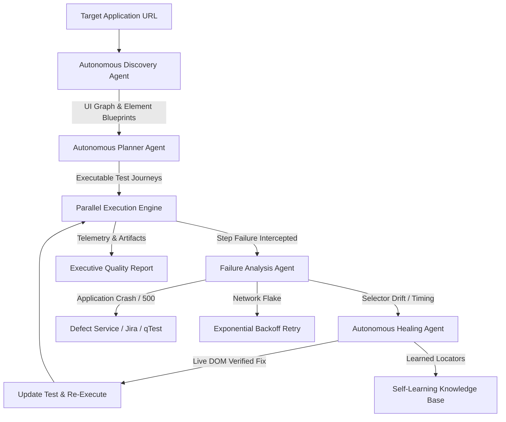

# SkyWatch Autonomous Testing Engine

## Executive Overview

SkyWatch is an **autonomous, self-learning Quality Assurance platform** powered by multi-agent collaboration. Unlike traditional test automation frameworks that rely on brittle, hardcoded scripts, SkyWatch operates on a **closed-loop autonomous lifecycle**:



---

## 1. The Autonomous Loop

### Phase 1: Autonomous Application Discovery (`AutonomousDiscoveryAgent`)
- **Depth-bounded crawling**: Explores application routes, pages, forms, modals, and navigation hierarchies without human prompting.
- **Resilient Multi-Locator Bundles**: For every interactive element, generates a prioritized resilience cascade:
  1. Primary Test ID (`data-testid`, `data-test`, `data-cy`)
  2. Accessibility Semantics (`aria-label`, accessible name, ARIA role)
  3. Form-Relative Selectors (`form#login input[name='email']`)
  4. Unique CSS Identifiers (`#submit-btn`)
  5. Semantic Text Matching (`button:has-text('Submit')`)
  6. Robust XPath Fallbacks
- **UI State Transition Graph**: Maps routes and state transitions (e.g. `Login -> Dashboard -> Products -> Checkout`).

### Phase 2: Autonomous Journey Planning (`AutonomousPlannerAgent`)
- Derives user journeys directly from discovered application blueprints.
- Generates coverage for:
  - Critical path happy flows
  - Negative validation checks
  - Input boundary conditions
  - Route navigation sanity
  - Accessibility standards

### Phase 3: Parallel Execution Engine (`ParallelExecutor`)
- Concurrent test execution across headless Playwright browser workers.
- **Adaptive Circuit Breaker**:
  - Automatically trips if failure rate exceeds 60% or if consecutive authentication failures occur.
  - Prevents denial-of-service or cascading overload against staging/test environments.
- High-fidelity artifact capture: video recordings, full-page screenshots, console logs, network request traces.

### Phase 4: Autonomous Failure Diagnosis (`AutonomousAnalysisAgent`)
When an execution step fails, it is immediately intercepted by the analysis agent for root-cause classification:

| Category | Typical Signal | Autonomous Action |
| :--- | :--- | :--- |
| **`SELECTOR_DRIFT`** | Locator timeout, element not found, strict mode violation | Dispatches to Healing Agent with candidate selectors |
| **`REGRESSION_BUG`** | 500 status code, crash stack trace, UI error alerts | Creates Defect, captures DOM trace, suggests Jira export |
| **`ENVIRONMENT_FLAKE`** | 502/504 gateway timeout, connection reset | Triggers retry with exponential backoff |
| **`AUTH_FAILURE`** | 401/403, redirected to `/login` | Halts dependent steps, refreshes authentication token |
| **`TIMING_ISSUE`** | Step timeout on slow-rendering asynchronous component | Adapts step settle time in route timing database |

### Phase 5: Autonomous Self-Healing (`AutonomousHealingAgent`)
When diagnosed as `SELECTOR_DRIFT` or `TIMING_ISSUE`:
1. Queries the **Self-Learning Repository** for historical verified locators for this action/target.
2. Evaluates candidate selectors generated by the analysis agent and heuristic fuzzy matchers.
3. **Live DOM Verification**: Injects candidate selectors into the active browser page to guarantee:
   - Exactly one matching DOM element exists.
   - The element is visible, non-disabled, and interactable.
4. Updates the test definition in-memory and persists the repair to `TestCaseAutomation`.
5. Logs an immutable **Healing Audit Record** (`before_selector`, `after_selector`, `confidence`, `strategy`).
6. Re-executes the failed step seamlessly, allowing the test run to complete without human interruption.

### Phase 6: Continuous Adaptive Learning (`SelfLearningEngine`)
- Caches verified locators into an application-scoped in-memory LRU cache and persistent vector collection.
- Records route timing profiles to automatically adjust settling intervals for slow views.
- Eliminates repeated healing latency on subsequent runs.

---

## 2. API Endpoints

The Autonomous Orchestrator is exposed via REST at `/api/v1/orchestrator`:

### Launch Campaign
```http
POST /api/v1/orchestrator/campaigns
Content-Type: application/json

{
  "application_id": 1,
  "target_url": "https://staging.app.example.com",
  "objective": "Complete autonomous regression and smoke audit",
  "max_concurrency": 3,
  "auto_heal_enabled": true
}
```

### Response
```json
{
  "campaign_id": "8f3b2d10-3c22-4a0b-9c7a-9e123456789a",
  "status": "queued",
  "target_url": "https://staging.app.example.com",
  "objective": "Complete autonomous regression and smoke audit",
  "message": "Autonomous QA campaign initiated successfully."
}
```

### On-Demand Application Discovery
```http
POST /api/v1/orchestrator/discover
Content-Type: application/json

{
  "target_url": "https://staging.app.example.com",
  "max_depth": 2,
  "max_pages": 15
}
```

### On-Demand Failure Diagnosis
```http
POST /api/v1/orchestrator/diagnose
Content-Type: application/json

{
  "action": "click",
  "selector": "#old-checkout-btn",
  "error_message": "Error: waiting for locator('#old-checkout-btn') to be visible: timeout exceeded"
}
```

### On-Demand Step Self-Healing
```http
POST /api/v1/orchestrator/heal-step
Content-Type: application/json

{
  "application_id": 1,
  "test_id": "test-order-flow",
  "step_index": 3,
  "action": "click",
  "failing_selector": "#old-checkout-btn",
  "candidate_selectors": ["button:has-text('Checkout')", "[data-testid='checkout-action']"]
}
```

---

## 3. Governance and Human-in-the-Loop Safeguards

1. **Healing Confidence Threshold**: Heals are only auto-applied if confidence meets or exceeds `0.70`. Below this threshold, recommendations are surfaced for human approval.
2. **Circuit Breakers**: Worker pool automatically shuts down if target server response codes degrade into widespread 5xx or repetitive auth rejection.
3. **Audit Trail**: Every auto-heal event produces an immutable audit record visible in the Audit Log and Test Run Details UI.
