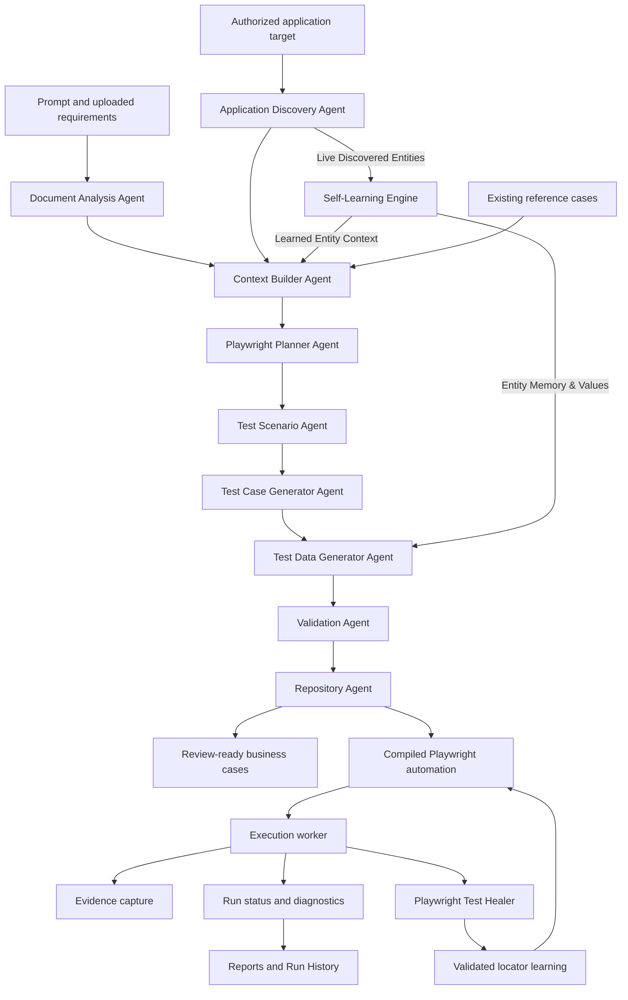

# Current Agent Architecture

**Assessment date:** 2026-09-03
**Status:** Implemented pilot architecture with explicit orchestration boundaries

## Executive Summary

AI QA Engine is no longer a single prompt-to-code path. The implemented generation workflow is a server-owned, application-aware pipeline with a real Playwright-backed discovery step, a real provider-backed Planner call, provider-backed Generator continuation batches, deterministic validation and repository stages, durable progress, and definition provenance.

It is not yet a fully autonomous multi-agent platform. Execution, Evidence, and Reporting are implemented operational services, but they are not independent AI agents with their own routing, budgets, policies, or event contracts. The system documents that distinction explicitly instead of treating every service label as an invoked agent.

## Current Flow

## Agent Usage Matrix

| Role | Current implementation | Invocation | Persisted output | Classification |
| --- | --- | --- | --- | --- |
| Document Analysis | Bounded parser for PDF, DOCX, TXT, CSV, XLSX, JSON, and Markdown context. | `POST /api/v1/ai-generation/documents/analyze` and generation job orchestration. | File metrics, warnings, extracted context. | Real deterministic agent boundary. |
| Application Discovery | Bounded HTTP and Playwright inspection of authorized target HTML, rendered controls, headings, inputs, links, and same-origin routes. | `discover_application_context()` in the generation job. | `result.discovery`, control/route metrics, and agent stage state. | Real deterministic/Playwright agent boundary. |
| Context Builder | Combines application metadata, discovery, documents, prompt, and reference cases. | `build_context_snapshot()` in the generation job. | `result.application_context`. | Real deterministic agent boundary. |
| Playwright Planner | Sends a structured provider request using planner guidance and context. | `generate_ai_test_plan()` with `agent_key="planner"`. | Planner plan, coverage matrix, provider/model provenance. | Real provider-backed agent. |
| Test Scenario | Selects enabled positive, negative, boundary, edge, security, accessibility, and validation categories. | `build_scenario_snapshot()` in the generation job. | `result.scenario_plan`. | Deterministic orchestration boundary. |
| Test Case Generator | Sends structured provider requests in continuation batches, avoids duplicate titles, and applies source-anchor quality gates. | `generate_ai_test_cases()` with `agent_key="generator"` for provider telemetry. | Candidate cases, target count, call count, generation mode/provider. | Real provider-backed agent. |
| Test Data Generator | Synthesizes realistic, type-safe valid, invalid, boundary, and edge datasets with learned live entities and fallback rules. | `TestDataGeneratorService.generate_dataset()` in generation job stage 7 and `POST /api/v1/test-data/generate/{app_id}`. | `result.test_data_plan`, `TestDataset` entities, and case test data profiles. | Real hybrid AI/adaptive synthesis agent. |
| Validation | Checks duplicates, required content, step bounds, source relevance, and readiness signals. | Generation quality gate plus `build_validation_snapshot()`. | Coverage score, issue counts, review count. | Deterministic validation agent boundary. |
| Repository | Persists cases and compiles Playwright definitions. | `ai_generation_jobs._run_job()` repository stage. | Case IDs, automation definitions, review status. | Deterministic persistence agent boundary. |
| Playwright Test Healer | Generates a same-action locator replacement after a step/check failure. | `generate_healing_step()` during `execute_web_target()`. | Run `healed_steps`, evidence, and healing events. | Real provider-backed repair agent. |
| Self-learning | Harvests live DOM entities, maintains ChromaDB test data memory, validates same-action locator repair, and records route timings. | `SelfLearningEngine` methods in discovery, execution worker, and healer. | `app_{id}_test_data_memory`, learned automation, recommendations. | Continuous adaptive learning loop. |
| Execution | Runs compiled steps/checks in isolated Playwright browser contexts, auto-interpolates parameters with learned entities, and emits live events. | `run_queue.process_run()` and `execute_web_target()`. | Run status, steps, checks, diagnostics, artifacts. | Operational worker, not an AI agent yet. |
| Evidence | Captures screenshots, highlighted screenshots, video, trace, console, and network diagnostics. | Integrated in `execute_web_target()`. | Run-scoped artifact manifest and diagnostics. | Operational capability, not a standalone agent yet. |
| Reporting | Aggregates runs, defects, coverage, trends, and Run History views. | Frontend workspace aggregation and report APIs. | Rendered reports and history views. | Reporting surface, not a standalone agent yet. |

## What Happens After User Input

1. The frontend analyzes uploaded files before starting the durable generation job.
2. The job loads the selected application and existing reference cases.
3. Document Analysis and Application Discovery produce bounded context snapshots and harvest live entities.
4. Context Builder combines those snapshots with the prompt, reference cases, and learned entity memory.
5. Playwright Planner makes a real structured AI provider call.
6. Test Scenario creates the enabled coverage categories.
7. Test Case Generator makes one or more provider calls using the plan and continuation exclusions.
8. Test Data Generator synthesizes typed, valid, invalid, boundary, and edge datasets using discovered entities.
9. Validation applies structure, duplicate, bounds, and source-anchor checks.
10. Repository persists business test cases, attaches dataset rows, and compiles automation.
11. The frontend polls the owned job and renders server-owned stage progress, provider provenance, metrics, and review counts.

## What Is Not Mocked

- Planner provider calls use the configured provider boundary and are logged with provider, model, duration, and prompt length.
- Generator provider calls use continuation batches and record generation mode, provider, target count, and call count.
- Application Discovery uses real HTTP/Playwright inspection against the authorized target when reachable.
- Execution uses the real Playwright worker, screenshots, traces, video, diagnostics, and bounded healer calls.
- Persistence uses the existing SQLAlchemy/Alembic database and application ownership boundary.

## What Remains Deterministic

Deterministic stages are intentional reliability boundaries, not fake AI calls:

- Document parsing and metric extraction.
- Context aggregation and module/risk signal derivation.
- Scenario category selection.
- Validation and quality scoring.
- Automation compilation from business-case text.
- Repository persistence and collision-safe case numbering.
- Report aggregation and Run History filtering.

These stages should remain deterministic until an AI decision provides measurable value, a versioned contract, an evaluation set, and a safe fallback.

## Uploaded Documents as Primary Context

Uploaded requirements are authoritative when provided. The generation prompt explicitly treats live UI and existing cases as supporting evidence, while the source-anchor quality gate rejects cases that cannot be traced to the prompt, document context, or selected module focus. If filenames are present but extraction produces no context, the job fails with a document-analysis warning rather than silently generating generic cases.

## Agent Visibility and Provenance

Each durable generation job stores:

- `workflow_version`.
- `agent_definitions` with source path, version, and checksum.
- `agent_stages` with status, progress, detail, start/finish timestamps, and metrics.
- `discovery`, `application_context`, `planner`, `scenario_plan`, and `validation` snapshots.
- Provider/model and Generator continuation telemetry.
- Persisted case IDs and review counts.

The frontend `AIGenerationConsole` polls this server-owned state and shows the active stage, progress, event stream, and completed stage strip. A stage is not considered AI-provider-backed merely because its label contains “Agent”; the stage matrix above is the authority.

## Current Gaps

- Execution, Evidence, and Reporting do not yet have independent agent definition files, policy contracts, or autonomous decision loops.
- Per-agent routing, model budgets, retries, evaluation datasets, cost accounting, and circuit breakers are incomplete.
- Discovery is currently a bounded first-page/same-origin snapshot, not a full authenticated application map or workflow graph.
- Self-learning stores the latest validated locator in test-case automation and an audit/recommendation record, but does not yet expose rollback/version history or cross-case selector memory.
- Browser E2E, accessibility, load/concurrency, queue-failure, and visual regression gates remain incomplete.

## Source of Truth

- [Agent definitions](../.github/agents/)
- [Agent registry](../backend/app/services/agent_definitions.py)
- [Generation pipeline](../backend/app/services/ai_generation_pipeline.py)
- [Durable generation job](../backend/app/services/ai_generation_jobs.py)
- [AI provider and discovery service](../backend/app/services/ai_service.py)
- [Playwright execution worker](../backend/app/services/test_execution.py)
- [Run queue](../backend/app/services/run_queue.py)
- [AI generation console](../frontend/src/components/AIGenerationConsole.tsx)
