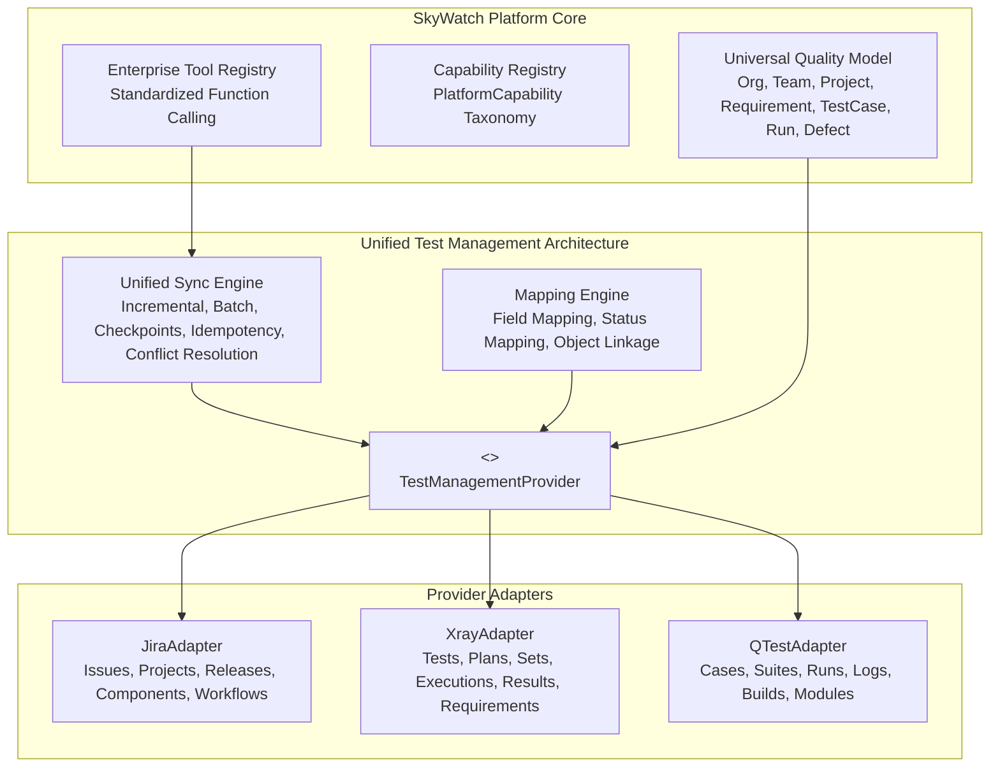

# SkyWatch Enterprise Platform: Current-State Assessment & Architecture Inventory

> **Document Version:** 1.0.0  
> **Date:** 2026-09-20  
> **Charter:** Unified Enterprise Quality Engineering, Test Management, Multi-Cloud, and Agentic AI Architecture  
> **Methodology:** Analyze → Reuse → Extend → Consolidate → Refactor → Test → Create only when necessary

---

## 1. Executive Summary

This assessment provides an exhaustive baseline analysis of the SkyWatch platform as of version `2.6.1`. It evaluates the system across five foundational pillars:
1. **Application Architecture & Core Infrastructure**
2. **Testing & Execution Engine**
3. **Agentic AI & Model Orchestration**
4. **Test Management & ALM Integrations (Jira, Xray, qTest, Git, CI/CD)**
5. **Engineering Health, Duplication & Security**

The primary purpose of this assessment is to establish what is working, what can be reused, what is missing, and what must be refactored to achieve the target unified architecture without breaking local execution.

---

## 2. 12-Factor Current-State Architectural Matrix

### 2.1 What Works (Production-Ready & Fully Verified)
* **Local Offline Execution**: Zero-cloud Playwright runner across Chromium, Firefox, and WebKit with video, screenshots, DOM capture, and locator self-healing (`LocalExecutionProvider`).
* **Canonical Execution Contract**: Complete `CanonicalExecutionRequest`, `CanonicalExecutionResult`, `BrowserType`, and `ExecutionMode` abstractions (`canonical_execution.py`).
* **Multi-Environment Execution Providers**: Registered providers for `local`, `sauce_labs`, `lambdatest`, and `cloud_container` (Docker, Azure, GCP, AWS) with capability advertising and health probes.
* **Agentic Execution Provider Selection**: Capability orchestrator dynamically analyzes test objectives and routes executions to the optimal provider with automatic local fallback (`select_execution_provider`).
* **AI Model Connectivity**: Dual-mode Google Gemini connectivity (OpenAI-compatible and native endpoints) with automatic model alias translation (`gemini-flash-latest`), automatic `certifi` CA bundle resolution on macOS, and multi-provider fallback (`github_copilot`, `openai`, `azure_openai`, `anthropic`, `local`).
* **Script Generation Engine**: 6-framework test generator (Playwright TS/Python, Cypress, Selenium Python, Robot Framework, Java TestNG, Jest Puppeteer).
* **Core REST API**: FastAPI backend with JWT authentication, role-based access control (`admin`, `qa_lead`, `tester`, `viewer`), SQLite/PostgreSQL persistence, and Alembic migrations.
* **Unified Quality Model Baseline**: Foundational Pydantic schemas for `CanonicalOrganization`, `CanonicalTeam`, `CanonicalProject`, `CanonicalRequirement`, `CanonicalTestCase`, `CanonicalExecutionResult`, `CanonicalDefect`, and `CanonicalReport`.

### 2.2 What Is Partially Working (Functional but Incomplete)
* **Jira Integration (`JiraClient`)**:
  * *Working*: Read-only requirements listing, single issue fetching, bug creation with ADF v1 payload, multipart attachment upload, issue linking, transition listing and execution, and comment adding.
  * *Incomplete*: Lacks full CRUD (update issue, delete/archive issue, component management, release/version CRUD, project discovery/mapping, user assignment search, workflow discovery).
* **qTest Integration (`QTestClient`)**:
  * *Working*: Connection testing, listing assets, defect creation, build listing and creation under releases, auto-test-log submission, test case export.
  * *Incomplete*: Lacks full CRUD for Test Cases (create, read, search, update, delete/archive), Test Suites (create, read, update, delete), Test Runs (create, read, update, search), attachment sync, and bidirectional result synchronization.
* **Tool Registry (`EnterpriseToolRegistry`)**:
  * *Working*: Registry structure, OpenAI function calling schemas, tool execution wrappers for execution dispatcher, script generation, and document analysis.
  * *Incomplete*: Jira and qTest tools (`_JiraIntegrationTool`, `_QTestIntegrationTool`) are stubbed with static responses instead of executing real API operations against configured connections.
* **Frontend Integration Panel (`IntegrationConnectionsPanel.tsx`)**:
  * *Working*: Lists and creates Jira/qTest connections, displays health status and test results.
  * *Incomplete*: Hardcoded to `jira` and `qtest` only, missing project-scoped multi-connection management, field/status mapping UI, and bidirectional sync controls.

### 2.3 What Is Missing (Genuinely Required for Enterprise Charter)
* **Xray Enterprise Integration (`XrayClient`, `XrayAdapter`)**:
  * 100% missing in the current codebase.
  * Required: Full CRUD for Tests, Test Plans, Test Sets, and Test Executions; result import and normalization; requirement and defect linking; evidence attachments; Xray Cloud & Server/DC REST API support.
* **Unified Test Management Architecture (`TestManagementProvider`)**:
  * Currently, `JiraClient` and `QTestClient` are separate classes inheriting from a generic HTTP `IntegrationClient`.
  * Required: A standardized `TestManagementProvider` abstract interface that defines unified contracts for Tests CRUD, Test Plans, Test Sets, Executions, Result Import, Defects, and Requirements.
* **Reusable Bidirectional Synchronization Engine (`SyncEngine`)**:
  * No unified synchronization engine exists. Sync is done ad-hoc or via one-way export methods.
  * Required: One reusable engine supporting incremental sync, pagination, batching, checkpointing, retries, idempotency, conflict detection, partial failure reporting, and cancellation.
* **Canonical External Object Mapping (`ExternalObjectMapping`)**:
  * Current `ExternalIssueLink` table only links SkyWatch defect/run/case IDs to an external issue key.
  * Required: Full object mapping tracking `provider`, `integration_id`, `project_id`, `skywatch_object_id`, `external_object_id`, `external_key`, `last_synced_at`, `sync_version`, and `mapping_status`.
* **Configurable Field & Status Mappings**:
  * Currently hardcoded in adapter methods.
  * Required: Configuration-driven field mappings and workflow status mappings stored per integration connection.
* **Agentic Test Management Tools**:
  * Missing `_XrayIntegrationTool` and production execution wiring for Jira and qTest tools in `tool_registry.py`.

### 2.4 What Is Duplicated (Candidates for Consolidation)
* **Credential Resolution**: Present across `secrets.py`, `integration_secrets.py`, and inline environment lookups in `ai_service.py` and `integration_service.py`. Should be consolidated into a unified `CredentialResolver`.
* **HTTP Client Request & Retry Logic**: Duplicated across `integrations.py` (`IntegrationClient._request`), `llm_client.py`, and `ai_service.py` (`_post_chat_completion`). Should share standard backoff, rate-limiting, and error-handling utilities.
* **Model Alias Translation**: Repeated across `ai_service.py` and `llm_client.py`.

### 2.5 What Is Obsolete / Hardcoded (To Be Refactored)
* **Global Connection ID Shortcuts**: `ENVIRONMENT_CONNECTION_IDS = {"jira": -1, "qtest": -2}` in `integration_service.py` hardcodes singleton environment connections instead of allowing project-scoped multi-connection topologies.
* **Read-Only Enforcement**: Hardcoded `INTEGRATIONS_READ_ONLY=true` checks in `config.py` and `integrations.py` block legitimate enterprise write/CRUD operations even when configured and authorized by admins.
* **Frontend System Enum**: `export type IntegrationSystem = "jira" | "qtest"` hardcoded in TypeScript types.

---

## 3. Detailed Component Assessment

### 3.1 Application & Core
| Component | Status | Assessment & Recommendation |
| :--- | :--- | :--- |
| `app/core/config.py` | Working | Settings model is comprehensive. Needs flexible write permissions for enterprise integrations. |
| `app/core/database.py` | Working | SQLite default for local offline development; PostgreSQL supported via connection pooling. |
| `app/core/capabilities.py` | Working | 18 canonical platform capabilities registered. Retain and extend. |
| `app/core/tool_registry.py` | Partial | Tool descriptors standardized. Wire actual execution for ALM tools and add Xray. |
| `app/models/integration_connection.py` | Working | Clean table schema. Can store metadata, field mappings, and sync state in `last_metadata`. |
| `app/models/external_issue_link.py` | Working | Tracks issue links. Needs extension or companion model for full bidirectional object mapping. |

### 3.2 Execution & Multi-Environment Engine
| Component | Status | Assessment & Recommendation |
| :--- | :--- | :--- |
| `LocalExecutionProvider` | Working | Gold standard for zero-cloud local execution. Must never be broken. |
| `SauceLabsExecutionProvider` | Working | Clean adapter for real mobile devices and cross-browser cloud grid. |
| `LambdaTestExecutionProvider` | Working | Playwright CDP adapter with 3000+ browser matrix. |
| `CloudContainerExecutionProvider`| Working | Containerized execution for Docker, Azure, GCP, and AWS. |
| `CapabilityOrchestrator` | Working | Intelligent provider selection and plan objective generation. |

### 3.3 Test Management & Integrations
| Provider | Readiness | Required Evolution |
| :--- | :--- | :--- |
| **Jira** | 60% | Add issue update, transition discovery, version/release management, component management, and project discovery. |
| **qTest** | 50% | Add test case search/CRUD, test suite management, test run management, and result synchronization. |
| **Xray** | 0% | Build from ground up: `XrayClient`, `XrayAdapter`, test plan/set/execution integration, result import, and defect linkage. |
| **Git** | 70% | `GitHubProvider` exists in `git_providers/`. Need unified commit-to-test traceability in the sync engine. |

---

## 4. Reusability & Consolidation Blueprint

### Key Principles for Evolution:
1. **Extend `IntegrationClient`**: Keep the battle-tested HTTP handling, SSL resolution, and auth mechanisms; extend into `TestManagementProvider`.
2. **One Sync Engine**: Do not write three separate sync engines. Write one `SyncEngine` that operates on `TestManagementProvider` methods (`fetch_updated_items`, `push_item`, `resolve_conflict`).
3. **Canonical Mapping**: All external entities map to/from `universal_quality_model.py` schemas before entering core storage or AI workflows.
4. **Local Fallback Always**: If Jira, Xray, or qTest are unconfigured or offline, SkyWatch operates with 100% functionality using its built-in local database.
