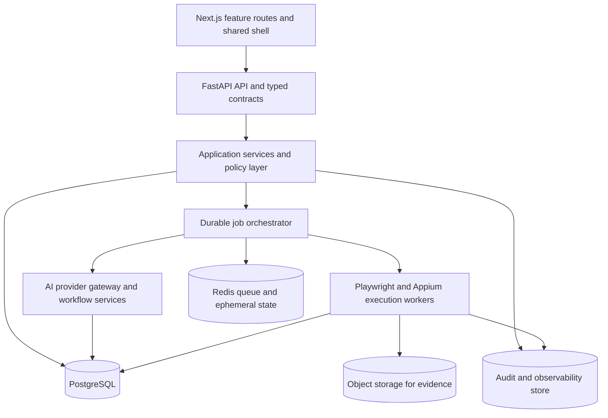
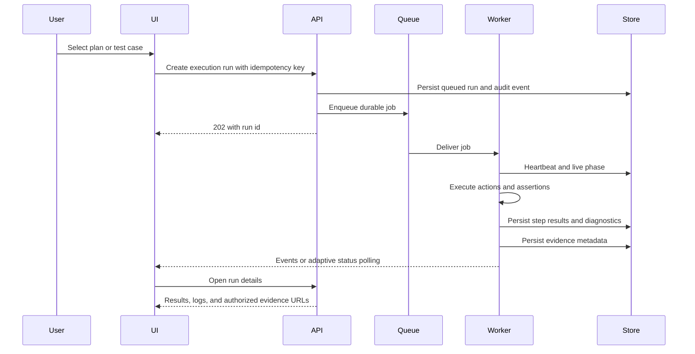

# Enterprise Modernization Report

## Scope

This report records the architecture assessment and the modernization work started in the current repository. The assessment was read-only until the implementation plan was agreed. Existing runtime data and user changes were preserved.

## Verified Architecture

- The Next.js App Router exposes feature URLs, but most routes re-export the large client implementation in `frontend/src/app/page.tsx`.
- The root client component owns authentication, navigation, data loading, AI generation, execution, defects, reports, settings, and audit UI state.
- `frontend/src/lib/api.ts` is the shared request helper and uses a configurable `NEXT_PUBLIC_API_URL`.
- FastAPI routes are grouped under `backend/app/api/v1` and assembled by `router.py`.
- SQLAlchemy models and Pydantic schemas cover applications, cases, executions, suites, defects, evidence, agents, users, and audit records.
- AI generation captures target context with HTTP and Playwright, calls a provider, quality-gates the response, persists cases, builds automation, and writes audit records.
- Execution supports both local in-process workers and Redis/RQ workers.
- SQLite is the local default database; PostgreSQL compatibility is configuration-based.

## Strengths

- Functional end-to-end QA workflow from application onboarding through execution and reporting.
- Provider-specific AI logic is isolated in `ai_service.py`.
- Browser execution has structured actions, checks, artifacts, live states, and diagnostics.
- Domain API modules and persistence models provide a reasonable foundation for extraction into stronger service boundaries.
- Existing audit persistence can evolve into a searchable audit and observability system.

## Principal Gaps

- Frontend feature ownership is concentrated in one large client component, creating coupling and rerender risk.
- App Router pages now use explicit section adapters, but feature behavior is not yet independently owned by each route.
- Backend route modules contain substantial business logic, while repository usage is inconsistent.
- The primary generation UI now uses durable AI jobs; idempotency, cancellation, attempt history, and event streaming remain future hardening work.
- Local worker execution is not durable across API restarts and differs from Redis execution.
- Correlation-aware request and AI lifecycle logging now exists; queue latency, retry, cancellation, dead-letter, and broader provider telemetry remain incomplete.
- Development configuration paths still include unsafe secret and demo-credential defaults; production startup checks now reject the most dangerous defaults, but coverage needs hardening.
- Settings and Audit Logs now live in the Administration navigation group; empty layout/UI utility placeholders remain extraction candidates.
- Empty `frontend/src/components/Layout.tsx` and UI utility placeholder modules remain extraction candidates; auth, toast, validation, shared types, navigation, and shell primitives are now implemented.
- The repository previously contained duplicate `doc/` and `docs/` trees; the follow-up consolidation now leaves `docs/` as the single canonical tree.
- Runtime database and log artifacts should be kept out of source-control workflows.

## Implemented In This Phase

- Added request correlation IDs to backend requests and `X-Correlation-ID` response headers.
- Added centralized correlation-aware logging helpers in `backend/app/core/logging.py`.
- Added structured AI lifecycle events for generation start, context analysis, prompt creation, provider response, validation, failure, and persistence.
- Recorded provider duration and token usage fields when returned by the provider.
- Added frontend milestones for request receipt, context analysis, source parsing, prompt creation, provider response, validation, persistence, refresh, and completion.
- Improved frontend network errors so the failing URL and remediation are visible instead of only `Failed to fetch`.
- Consolidated navigation so AI settings has one canonical System location and Audit Logs is grouped with administration.
- Unified JWT configuration through `backend/app/core/config.py`.
- Added production startup checks for unsafe signing keys and demo admin passwords.
- Changed private-target access to opt-in instead of default-on.
- Fixed dynamic AI generation when `max_cases` is omitted.
- Added a root CI workflow with frontend typecheck/unit-test/build/npm-audit and backend compile/migration/test/pip-audit gates.
- Repaired the Copilot setup workflow to use the `frontend/` working directory and the valid `npm run build` command.
- Upgraded the frontend to Next.js `16.3.4`; the production npm audit now reports zero vulnerabilities.
- Added root `Makefile` validation targets and canonical security, testing, changelog, and documentation index files.
- Removed five confirmed tracked generated artifacts: legacy databases, execution backup source, and output logs.
- Added formal Alembic environment/baseline, guarded local legacy adoption, and the required-column constraint migration.
- Added run-scoped evidence authorization and regression coverage for missing/unknown run scopes.
- Made Redis queue mode fail closed and recorded queue failures as terminal, auditable run/job outcomes.
- Added Vitest/jsdom frontend unit testing for authentication, validation, cache invalidation, and typed API errors.
- Extracted shared frontend shell, navigation configuration, icons, toast, auth, validation, and domain types from the root page.

## Remaining Work

### Priority 1: Reliability and observability

1. Harden durable AI generation jobs and lifecycle events across every generation entry point.
2. Stream backend lifecycle events through server-sent events or WebSockets.
3. Standardize error envelopes with correlation IDs.
4. Add regression tests for dynamic and explicit case counts.
5. Add queue latency, retry, cancellation, and dead-letter metrics.

### Priority 2: Security

1. Rotate any previously exposed AI or OAuth credentials.
2. Use secure cookie-based sessions or a hardened token strategy.
3. Add rate limiting for login, generation, execution, and uploads.
4. Add strict SSRF allowlists and egress controls.
5. Add upload size, MIME, malware, and artifact authorization checks.
6. Redact prompts, credentials, tokens, and provider responses from logs.

### Priority 3: Frontend decomposition

1. Extract the application shell and navigation into real layout components.
2. Create feature hooks for applications, cases, AI generation, execution, and audit.
3. Introduce server-state caching and request deduplication.
4. Convert route aliases into independently testable feature pages.
5. Standardize loading, empty, error, and success states.

### Priority 4: Scalability and performance

1. Use Redis/RQ as the production execution queue.
2. Move AI generation and target discovery to durable jobs.
3. Add pagination and indexes to list APIs.
4. Lazy-load evidence, reports, agents, and settings.
5. Virtualize large tables and event logs.
6. Replace fixed polling with adaptive polling or event streaming.
7. Move production persistence to PostgreSQL.

### Priority 5: Cleanup and governance

1. Confirm references with import analysis before removing empty or legacy modules.
2. Select one canonical documentation directory and archive the duplicate.
3. Separate runtime databases, logs, uploads, and generated artifacts from source assets.
4. Add CI for type checks, builds, backend tests, dependency audits, and security checks.
5. Record architectural decisions for routing, queueing, AI providers, and data retention.

## Cleanup Impact Policy

This phase removed only five reference-checked tracked generated artifacts: `backend/app.db`, `backend/test_automation.db`, `backend/out.txt`, `backend/run_output.txt`, and `backend/app/api/v1/execution.py.backup`. No active product module was deleted. Remaining untracked local runtime files and duplicate documentation are preserved until their data, import, route, and inbound-link checks are complete.

## Validation Completed

- Frontend production build passes.
- Backend changed modules compile successfully.
- JWT creation and decoding pass a local round-trip check.
- Dynamic AI generation returns HTTP 201 when `max_cases` is omitted.
- Browser generation completes and navigates to the generated test-case repository.

## Master Assessment: Current State vs Future State

**Assessment date:** 2026-09-02
**Repository:** `AutomationTool_POC` at `2f6e3ca`
**Assessment mode:** Read-only architecture and product audit. This section defines the next modernization program; it does not claim that the future state is implemented.

### Assessment Method

The assessment combined repository inventory, source inspection, route and endpoint scans, duplicate-file hashing, dependency checks, and the existing frontend/backend validation commands. Verified observations include:

- 15 frontend App Router page files; 13 are two-line aliases of the root page and one is the dedicated dynamic run-details route.
- `frontend/src/app/page.tsx` is approximately 7,259 lines and `frontend/src/app/globals.css` is approximately 7,756 lines after the first extraction wave.
- The root client page contains approximately 90 `useState` calls and most feature data loading and mutation logic; shared auth, types, navigation, API policy, shell rendering, icons, validation, toast behavior, and durable AI polling now live outside it.
- The backend contains 18 v1 API modules and approximately 86 route decorators.
- `backend/app/services/ai_service.py` is approximately 1,573 lines and `backend/app/services/test_execution.py` is approximately 984 lines.
- At the 2026-09-02 assessment, `doc/` and `docs/` contained 18 overlapping Markdown file names; 8 pairs were byte-identical and 10 pairs required drift review. The 2026-09-03 follow-up completed that review and removed the legacy tree.
- The repository now has a push/PR CI workflow plus a Copilot setup workflow; the root `Makefile` contains validation targets.
- The backend regression suite currently passes 6 tests on both the adopted local database and a fresh migrated database. A Playwright seed spec exists but remains a template, not an executable product regression suite.
- `npm audit --omit=dev --audit-level=high` and `pip-audit -r backend/requirements.txt` both pass after the frontend/backend dependency upgrades. Docker remains unavailable in the assessment environment, so container validation is still outstanding.

### Executive Conclusion

AI QA Engine is a strong working proof of concept with a credible end-to-end QA story: application onboarding, test design, AI-assisted generation, Playwright execution, evidence capture, defect management, reporting, and audit history are visible in one product. It is not yet an enterprise product because the system of record, route ownership, deployment contract, security lifecycle, and quality gates are incomplete or inconsistent.

The safest strategy is an incremental productization program, not a rewrite. Preserve the working execution and AI capabilities while extracting ownership boundaries, formalizing persistence and migrations, and making every user-visible workflow backed by a versioned API contract.

## 1. Current-State Product Assessment

### Strengths

| Area | Verified strength |
| --- | --- |
| Product narrative | The workflow demonstrates a recognizable lifecycle from application to test case to execution to evidence and reporting. |
| AI | Multiple provider adapters, rendered target context capture, structured output validation, generation metadata, and healer guidance are present. |
| Execution | Playwright supports structured actions, assertions, live states, screenshots, video, traces, diagnostics, and a dedicated run-details route. |
| Data | SQLAlchemy models and Pydantic schemas cover applications, cases, automations, runs, case executions, defects, suites, projects, AI jobs, agents, and audit records. |
| Security intent | PBKDF2 password hashing, JWT authentication, RBAC dependencies, secret resolution, redaction, audit events, and SSRF target validation exist. |
| UX intent | The design system has tokens, responsive rules, contextual empty states, live progress, artifact previews, and an interactive AI console. |
| Compatibility | Existing array response bodies were preserved while pagination metadata was added, reducing frontend migration risk. |

### Principal Weaknesses

| Severity | Finding | Impact |
| --- | --- | --- |
| High | Phase 0 removed runtime schema creation and raw `ALTER TABLE` operations from `backend/app/main.py`, added an ordered Alembic chain, adopted the local legacy database, and applied the required-column constraint migration. PostgreSQL upgrade/restore validation remains outstanding. | Existing database adoption is controlled locally; production migration drills are still required. |
| Critical | The frontend is a large client-side orchestrator. Most routes render the same root page and switch views through a `views` map. | High coupling, large initial client surface, difficult testing, and fragile changes. |
| High | The durable AI job API is now the main generation UI path, and the worker persists deduplication, automation, and provider metadata. It still needs idempotency, cancellation, attempt history, and durable event streaming. | Restart-safe generation exists at the job level but is not yet fully operable at scale. |
| High | Local in-process queueing remains available for development; Redis mode now fails closed, but retries, dead letters, cancellation, metrics, and worker heartbeats are incomplete. | Production operations still need full queue and execution controls. |
| High | Artifact access now verifies the requesting user owns the run and the filename is recorded on that run. Shared object storage, retention, signed URLs, and range support remain future work. | Multi-worker evidence operations and lifecycle governance are incomplete. |
| High | JWT tokens are held in memory and session storage, but there is no server-side revocation or session-version mechanism. | XSS exposure is reduced, but incident response and forced logout remain limited. |
| High | CI now runs from the correct frontend directory with valid npm commands and includes frontend/backend/security/migration gates. Browser, container, secret, and SAST gates remain to be added. | Release confidence is improved but the enterprise gate set is not complete. |
| High | The current dependency audits are clean after upgrading Next.js/PostCSS, FastAPI/Starlette, python-multipart, and PyJWT. Dependency update cadence and automated patch ownership remain undefined. | Future advisories can still accumulate without maintenance policy. |
| Medium | At the 2026-09-02 assessment, `doc/` and `docs/` overlapped across 18 Markdown file names, with 8 byte-identical pairs and 10 drifted pairs. | Resolved on 2026-09-03 by consolidating reviewed content into `docs/`; product naming still mixes AI QA Engine and Tractor Supply terminology. |
| Medium | Empty placeholder modules remain in frontend UI, toast/validation utilities, backend repositories, and service placeholders. Shared auth, types, navigation, and icon rendering are now implemented. | The directory structure still implies abstractions that are not real and increases discovery cost. |
| Medium | Large list endpoints, in-memory caching, polling, and large event/artifact payloads are not governed by a common server-state policy. | Increasing data volume will produce slower pages, repeated requests, and memory pressure. |

## 2. Frontend Audit

### Navigation and Page Ownership

The current navigation has these business areas: Dashboard, Projects, Applications, Test Repository, Test Execution, Test Suites and Plans, Defects, Reports Hub, Test Generation, Autonomous Agents, Evidence Gallery, AI and Settings, and Audit Logs. The grouping is an improvement over a flat menu, but it still exposes implementation-oriented concepts beside business workflows.

The route files under `frontend/src/app/` now declare explicit section adapters, but feature behavior is still composed by the root workspace page. The dedicated `/test-execution/[runId]` page remains the first independently owned feature surface and should become the pattern for all major workflows.

The standalone Evidence Gallery duplicates a portion of Test Execution. Evidence should be an execution sub-resource and a run-detail view, not a separate top-level destination. The future state should preserve `/evidence` as a temporary redirect while users and links migrate.

### Component and State Boundaries

Implemented components such as `ApplicationCapture`, `AIGenerationConsole`, `ExecutionRunDetailsPage`, `SettingsStudio`, `AuditLogViewer`, `WorkspaceNavigation`, `WorkspaceShell`, and `AuthScreen` prove that extraction works. However, the root page still owns selected application context, project state, application state, case state, suite state, defect state, execution polling, AI generation, evidence loading, and reports.

The following files are empty or effectively placeholders and must be either implemented or removed after reference verification:

- `frontend/src/components/Layout.tsx`
- `frontend/src/components/DashboardStats.tsx`
- `frontend/src/components/DefectList.tsx`
- `frontend/src/components/ExecutionHistory.tsx`
- `frontend/src/components/TestCaseTable.tsx`
- `frontend/src/components/ui/*`
- `frontend/src/lib/utils.ts`

The first extraction wave should establish shared types, API hooks, and feature components before introducing a global state library. Server state should be separated from transient form state; adding Zustand without that separation would move the coupling rather than remove it.

### UX, Responsiveness, and Accessibility

The UI has a deliberate token-based visual system and responsive media queries, and recent execution/evidence work was verified at desktop and mobile widths. Remaining gaps are consistency and governance:

- loading states are feature-specific rather than standardized;
- toast messages are now exposed through the shell as a polite status, but feature-level feedback is still not standardized;
- modal focus trapping and return focus are not centralized;
- keyboard and contrast audits are not part of CI;
- dense tables and diagnostic logs need virtualization or pagination at scale;
- inline styles and a 7,756-line global stylesheet make visual regression control difficult;
- the proposed generic CSS snippet (`a { color: #464feb }`, global table borders, and `#f5f5f5` headers) should not be applied globally because it bypasses the existing design tokens and creates a second visual language.

### Frontend Data and API Integration

`frontend/src/lib/api.ts` is now a common boundary for JSON, metadata, blob, and short-lived cached requests with a 30-second timeout, caller abort support, safe-read retries, typed errors, and mutation cache invalidation. Cache eviction scope, telemetry, and a full server-state query layer remain future work.

The target is a small server-state layer with:

1. typed request and error contracts;
2. cancellation and timeout via `AbortController`;
3. bounded retry for idempotent reads only;
4. query-key invalidation after mutations;
5. adaptive polling for active jobs;
6. consistent loading, empty, stale, and error states.

## 3. Backend Audit

### API and Domain Boundaries

The API is split into domain routers, which is a good external shape. Business logic is still mixed into route modules and direct SQLAlchemy queries are used alongside repository files. The repository layer is mostly empty, so there is no consistent transaction, authorization, pagination, or query policy.

Current meaningful domains are:

- identity and role management;
- applications and mobile artifacts;
- test cases, imports, automation, generation, and proposals;
- execution runs and case history;
- suites and execution plans;
- defects;
- agents and recommendations;
- evidence files;
- reports;
- audit logs;
- settings and provider discovery.

The future backend should use an application service per domain, typed command/query handlers, repository adapters for persistence, and route modules that only validate, authorize, call the service, and serialize the response.

### Persistence and Migration Risk

At the assessment baseline, `Base.metadata.create_all(bind=engine)` and `apply_schema_evolution()` executed during import/startup, while the baseline migration was empty and the AI-job revision was disconnected. Phase 0 removed runtime DDL, added a complete current-schema baseline, connected the AI-job revision, added explicit fresh/legacy migration bootstrap paths, and applied the required-column constraint migration. The verified local legacy database is now at the migration head; PostgreSQL upgrade/restore drills remain outstanding.

The remaining migration program must:

- add foreign keys for raw ownership fields such as application and run ownership;
- use explicit PostgreSQL-compatible types and constraints;
- run in a dedicated migration job before API replicas start;
- test upgrade, downgrade, backup, restore, and multi-replica startup;
- remove runtime DDL after migration parity is proven.

### AI Workflow

The AI service currently combines target fetch/rendering, context extraction, explicit provider selection, prompt construction, response parsing, provider error handling, generation validation, and healer requests. This is a strong prototype boundary but too large for independent operational control.

The future AI architecture separates:

- `ContextSnapshotService`: target metadata, rendered DOM, route and control observations;
- `RequirementAnalysisService`: normalized business requirements and risk taxonomy;
- `ScenarioGenerationService`: provider-independent scenario proposal generation;
- `ValidationService`: schema, duplicate, coverage, selector, and policy checks;
- `ReviewService`: human approval and edits;
- `AutomationCompiler`: deterministic conversion to executable actions/checks;
- `HealingService`: bounded locator repair with evidence and approval policy;
- `AIProviderGateway`: provider credentials, timeout, retry, circuit breaker, and usage telemetry.

AI should propose and explain. Deterministic validation and persistence should remain the source of truth.

### Execution, Queue, and Evidence

The Playwright engine has useful failure classification, fallback locators, live events, healer integration, screenshot capture, video recording, trace capture, and protected artifact streaming. It still needs an operational execution contract:

- durable run state and heartbeat;
- explicit retry attempt records;
- idempotency key and duplicate submission policy;
- cancellation and timeout enforcement;
- queue depth, latency, retry, failure, and dead-letter metrics;
- shared object storage for multi-worker artifacts;
- retention and deletion policy;
- artifact authorization by run ownership, not filename alone;
- range support and content metadata for video playback;
- redaction and payload-size limits for logs and AI context.

The current local thread fallback is appropriate for development only. Production must fail readiness when Redis is unavailable and must not silently downgrade to in-process execution.

### Security

Verified security controls include password hashing, JWT validation, RBAC dependencies, backend secret resolution, audit events, and default SSRF blocking. Gaps that block enterprise deployment include:

- development signing key and admin password defaults remain in configuration paths;
- the development Compose file provides unsafe defaults;
- browser local storage holds JWTs;
- there is no token revocation or rotation mechanism;
- login, generation, execution, upload, and AI provider endpoints lack rate limits and quotas;
- private-target bypass is an environment flag without a formal allowlist or security event policy;
- artifact file access does not bind the filename to the requesting user's run;
- file and import limits are not governed by one policy;
- Vault credentials are environment-based and secret refresh is not modeled;
- logs and prompt metadata require systematic secret/PII redaction;
- backend and frontend containers need non-root execution, resource limits, and health/readiness checks.

## 4. Current-to-Future Navigation Model

The left navigation should mirror the user's business journey rather than the backend router list.

```text
Dashboard

AI Workspace
	Application Analyzer
	Module Discovery
	Requirement Analysis
	AI Recommendations

Test Design
	Test Scenario Generator
	Test Case Generator
	Test Repository
	Traceability

Test Execution
	Execute Tests
	Execution Plans
	Schedules
	Run Evidence

Project Management
	Projects
	Releases
	Milestones
	Assignments

Reporting and Analytics
	Executive Dashboard
	Test Metrics
	Coverage
	Trends
	Export Reports

Administration
	Users
	Roles
	Audit Logs
	Integrations
	Settings
```

### Migration Map

| Current surface | Future location | Migration treatment |
| --- | --- | --- |
| Dashboard | Dashboard | Retain, reduce technical detail, add business-value metrics. |
| Applications | AI Workspace and Project Management | Retain as onboarding and analyzer entry point. |
| Autonomous Agents | AI Workspace / AI Recommendations | Rename around outcomes and review actions. |
| Test Generation | Test Design / Scenario and Case Generator | Split context analysis from proposal review. |
| Test Repository | Test Design / Repository | Add version, traceability, approval, and bulk operations. |
| Test Suites and Plans | Test Execution / Execution Plans | Separate reusable suites from scheduled plans. |
| Test Execution | Test Execution / Execute Tests | Retain live progress and run controls. |
| Evidence Gallery | Test Execution / Run Evidence | Deprecate top-level gallery and link evidence to runs. |
| Reports Hub | Reporting and Analytics | Split executive and engineering views. |
| Defects | Reporting and Analytics or Project Management | Link defects to runs, cases, requirements, and evidence. |
| AI and Settings | Administration | Keep provider configuration separate from user-facing AI workflow. |
| Audit Logs | Administration | Retain immutable audit access with retention/export policy. |

## 5. Future-State Architecture

### System Architecture



### AI Workflow



```mermaid
flowchart LR
		IN[Requirement or application target] --> SNAP[Context snapshot]
		SNAP --> ANALYZE[Requirement and risk analysis]
		ANALYZE --> PROPOSE[Scenario proposals]
		PROPOSE --> VALIDATE[Schema, coverage, duplicate, and policy validation]
		VALIDATE --> REVIEW[Human review and approval]
		REVIEW --> COMPILE[Deterministic automation compiler]
		COMPILE --> PLAN[Execution plan]
		PLAN --> RUN[Playwright or Appium run]
		RUN --> HEAL[Bounded healer on failure]
		HEAL --> REVIEW
		RUN --> EVIDENCE[Evidence and diagnostics]
		EVIDENCE --> REPORT[Executive and engineering reporting]
```

### Execution Workflow



### Canonical Domain Model

The future model should make relationships explicit:

```text
Project
	-> Release
	-> Application
	-> Milestone

Application
	-> Module
	-> Requirement
	-> TestCase

Requirement
	-> TestScenario
	-> TestCaseVersion

TestCase
	-> AutomationDefinition
	-> ExecutionPlan membership
	-> Defect links

ExecutionPlan
	-> ExecutionRun
	-> StepResult
	-> EvidenceArtifact
	-> Defect / Report links

AIJob
	-> ContextSnapshot
	-> Proposal
	-> ValidationResult
	-> AuditEvent
```

## 6. Missing Capability Analysis

| Capability | Current state | Future acceptance criterion | Priority |
| --- | --- | --- | --- |
| Requirement-to-test traceability | Partial proposal and case flows; no durable requirement entity. | Every approved case links to one or more requirements and displays coverage. | P1 |
| Impact analysis | Not a first-class workflow. | Application/module/requirement changes identify impacted cases and plans. | P2 |
| Risk assessment | Heuristic readiness exists; product risk score is not formalized. | Risk score combines business criticality, change impact, failure history, and coverage. | P2 |
| Coverage recommendations | AI prompts include scenario categories. | Gaps are persisted, reviewable, and measurable against requirements/modules. | P1 |
| Review and approval | Proposal and recommendation approval exists. | Generated cases remain staged until explicit human approval, with versioned edits. | P1 |
| Smart execution plans | Execution plans API exists but is not a complete product workflow. | Plans support selection, ordering, environment, retries, schedules, and ownership. | P1 |
| Parallel execution | Queue foundation exists; no documented capacity/isolation contract. | Worker pools execute independent runs with quotas and deterministic aggregation. | P2 |
| Retry strategy | Limited healer retry; no attempt model. | Retry policy distinguishes infrastructure, locator, assertion, and application failures. | P1 |
| Evidence | Screenshots, video, traces, and logs are captured. | Artifacts are run/step-linked, authorized, retained, searchable, and stored outside worker disk. | P1 |
| Executive reporting | Client-derived summaries exist. | Reports are server-backed, reproducible, exportable, and tied to a release. | P2 |
| User and role administration | Backend role endpoint exists; no complete admin UI. | User lifecycle, role assignment, access review, and audit export are available. | P2 |
| Integrations | Provider and Vault configuration foundations exist. | GitHub/Jira/Slack/CI integrations have typed connectors and health status. | P3 |

## 7. Naming and Source-of-Truth Standard

Use one public vocabulary across UI, API, models, schemas, docs, and telemetry:

| Concept | Canonical name |
| --- | --- |
| Test case | `TestCase` / `test_case` |
| Test case generator | `TestCaseGenerator` / `test-case-generator` |
| Scenario proposal | `TestScenarioProposal` / `test_scenario_proposal` |
| Execution run | `ExecutionRun` / `execution_run` |
| Step result | `ExecutionStepResult` / `execution_step_result` |
| Evidence | `EvidenceArtifact` / `evidence_artifact` |
| AI generation | `AIGenerationJob` / `ai_generation_job` |
| Healer | `PlaywrightTestHealer` / `playwright-test-healer` |
| Application | `Application` / `application` |
| Project | `Project` / `project` |

Rules:

- no `TCGen`, `TCGenerator`, `Test_Case_Generator`, or unexplained abbreviations;
- use lowercase snake case in API paths and database columns;
- use PascalCase for TypeScript/Python domain types and classes;
- use explicit enums for lifecycle, execution status, provider, role, and failure type;
- reserve `status` for lifecycle outcome and `phase` for current processing phase;
- keep provider aliases only at configuration compatibility boundaries and document their deprecation;
- move shared frontend types out of `page.tsx` into `frontend/src/types/`.

## 8. Documentation Strategy

`docs/` is the canonical documentation root. The overlapping Markdown file names and redundant drafts were reconciled, reference-checked, and consolidated into canonical guides under `docs/`. External consumers remain a follow-up verification responsibility because they are outside the repository scan.

Target documentation set:

```text
docs/
	Current-State.md
	Future-State.md
	Architecture.md
	Technical-Design.md
	AI-Architecture.md
	Navigation-Strategy.md
	Module-Mapping.md
	Data-Flow.md
	Deployment-Guide.md
	Security-Guide.md
	Performance-Guide.md
	Troubleshooting.md
	Release-Notes.md
	Changelog.md
	Coding-Standards.md
	Contribution-Guide.md
	Testing-Strategy.md
	Disaster-Recovery.md
	Observability.md
	adr/
```

README should remain a short product and quick-start document. It now links to the approved modernization, security, and testing documentation and records the runtime video-capture default as enabled.

Product naming needs a deliberate rule: **AI QA Engine** is the platform name; **Tractor Supply Company** is the customer/target context when relevant. Existing executive and architecture documents should not be mechanically changed until that distinction is agreed.

## 9. Cleanup and Repository Optimization Plan

Cleanup is safe only after import, route, script, and documentation reference checks.

### Immediate candidates

- tracked `backend/app.db` and `backend/test_automation.db`;
- tracked `backend/app/api/v1/execution.py.backup`;
- tracked `backend/out.txt` and `backend/run_output.txt`;
- completed documentation consolidation and canonical `docs/` index;
- empty frontend placeholder components, hooks, types, and validation files;
- empty backend repositories and `defect_service.py`/`report_service.py` after confirming no external imports;
- unused assets after checking build and documentation references.

### Do not delete yet

- runtime SQLite databases that may contain user data until an export/backup decision is made;
- uploaded mobile artifacts;
- agent definition files under `.github/agents`, because the backend loads their content for runtime guidance;
- evidence and trace files required for demonstration or incident review;
- duplicate documentation before inbound links are migrated.

### Cleanup deliverable

Every deletion change should include a report with: removed files, removed packages, merged components, migration/reference checks, test results, and rollback instructions.

## 10. Enterprise Quality Gates

The release pipeline should enforce the following sequence:

1. frontend type check;
2. frontend lint;
3. frontend production build;
4. backend compile and lint;
5. backend unit and API contract tests;
6. migration upgrade/downgrade tests against SQLite and PostgreSQL;
7. integration tests for auth, CRUD, AI jobs, queue states, execution, and artifacts;
8. Playwright browser smoke and responsive checks;
9. dependency audits (`npm audit`, `pip-audit` or equivalent);
10. SAST, secret scan, and container scan;
11. documentation link and naming checks;
12. clean-worktree and generated-file checks.

Release requirements:

- zero build, type, and lint errors;
- zero critical or high dependency vulnerabilities unless explicitly risk-accepted;
- no default production secrets;
- migrations are reproducible and rollback-tested;
- every new feature has an API/UI test or a documented exception;
- changelog and release notes are updated;
- Docker and deployment validation runs in CI, not only on a developer workstation.

## 11. Phased Modernization Roadmap

### Phase 0: Release safety and documentation truth (completed)

- Fixed CI working directories and build command.
- Upgraded/pinned vulnerable Next.js/PostCSS, FastAPI/Starlette, multipart, and PyJWT versions after compatibility testing.
- Added `Makefile` targets and a canonical developer workflow.
- Added `Changelog.md`, `Security-Guide.md`, and `Testing-Strategy.md`.
- Removed tracked legacy databases/logs/backups after reference checks.
- Selected `docs/` as the canonical documentation root.
- Formalized Alembic migrations and local legacy-database adoption.

### Phase 1: Frontend ownership (in progress)

- Extracted the application shell, auth boundary, navigation configuration, icons, toast, validation, shared types, and explicit route adapters.
- Create feature modules for dashboard, applications, projects, test design, execution, defects, reports, and administration.
- Moved types, validation, API policy, authentication, navigation, and shell behavior into shared modules.
- Add error boundaries, skeletons, keyboard focus management, and consistent mutation feedback.
- Keep URLs stable while replacing alias pages with real route components.

### Phase 2: Persistence and API contracts (partially complete)

- Built a complete Alembic baseline, removed runtime DDL, and added the required-column constraint migration.
- Added missing model indexes and guarded local legacy adoption.
- Introduce typed pagination envelopes without breaking existing consumers.
- Standardize error responses with correlation ID and machine-readable code.
- Secured artifact access by run ownership and recorded artifact metadata; object storage remains future work.

### Phase 3: Durable jobs and scalable execution (partially complete)

- Routed AI generation through `AIGenerationJob` in the UI.
- Add durable execution attempts, heartbeats, cancellation, retries, and idempotency.
- Redis mode now fails closed in production; readiness and queue health remain to be exposed.
- Separate queues by workload and define worker concurrency/resource limits.
- Add artifact retention, object storage, and lifecycle cleanup.

### Phase 4: AI workflow productization

- Add application analyzer, module discovery, requirement analysis, risk, and coverage views.
- Stage proposals before persistence; support selective approval, editing, and regeneration.
- Link proposals and cases to requirements and application modules.
- Persist provider/model/agent version, prompt hash, snapshot ID, validation result, and approval history.
- Make healer behavior policy-driven and auditable.

### Phase 5: Execution planning and client demonstration

- Build execution plans, schedules, environment selection, release gates, and comparative reports.
- Present business metrics first: coverage, pass rate, risk, release health, cycle-time savings, and automation ROI.
- Keep technical diagnostics one interaction away in dedicated run details.
- Add Jira/CI/webhook integrations only after the core run contract is stable.

## 12. Definition of Done for the Future State

The platform is enterprise-ready only when a new user can:

1. create a project and application;
2. analyze the application and discover modules;
3. import or describe requirements;
4. receive AI scenario proposals with risk and coverage rationale;
5. edit and approve selected cases;
6. trace cases to requirements and modules;
7. create an execution plan and choose an environment;
8. run cases through durable workers;
9. inspect step-level results, screenshots, video, traces, network logs, and healer actions;
10. triage defects with linked evidence;
11. view executive and engineering reports tied to a release;
12. audit who changed, approved, executed, or exported each artifact.

Operationally, the same release must have reproducible migrations, explicit secrets, bounded resources, queue health, artifact retention, security scanning, automated browser checks, and a single canonical documentation set.

## Assessment Decision

Proceed with the phased roadmap above. Do not start broad UI redesign or delete duplicate files until Phase 0 establishes CI, dependency, migration, documentation, and source-control gates. The working AI and Playwright capabilities are valuable assets; the priority is to give them durable contracts, clear ownership, and an enterprise operating model.
