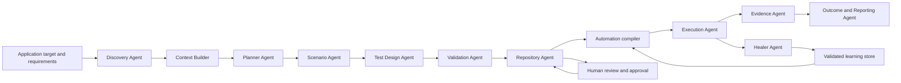

# Future Agent Architecture

**Status:** Target architecture and staged roadmap
**Current baseline:** See [CURRENT_AGENT_ARCHITECTURE.md](CURRENT_AGENT_ARCHITECTURE.md)

## Goal

Evolve AI QA Engine from a server-orchestrated generation pipeline into a governed agent platform while keeping business test cases as the primary artifact and compiled automation as a secondary artifact.

The future design must preserve the current strengths:

- application-scoped data and ownership;
- uploaded requirements as authoritative context;
- real Playwright discovery and execution;
- Planner-first, batched Generator behavior;
- bounded Validation and Repository fallbacks;
- explicit human review for business-flow changes;
- auditable, reversible self-healing.

## Target Flow



## Agent Contracts

Every agent should expose the same envelope, whether the implementation is deterministic or provider-backed:

```json
{
  "job_id": "durable-job-id",
  "application_id": 1,
  "agent_key": "planner",
  "agent_version": "definition-version",
  "status": "completed",
  "input_refs": ["document:checkout.md", "discovery:latest"],
  "output_ref": "artifact-or-snapshot-id",
  "metrics": {},
  "warnings": [],
  "started_at": "timestamp",
  "finished_at": "timestamp"
}
```

Required properties:

- scoped to one application/workspace;
- bounded input and output sizes;
- source and artifact references instead of unbounded prompt text;
- explicit status, warnings, metrics, and timestamps;
- definition version/checksum provenance;
- retry and timeout policy;
- redaction policy for credentials and sensitive test data;
- explicit provider failure states where provider output is unavailable;
- an auditable decision record for mutations.

## Target Responsibilities

| Agent | Decision responsibility | Mutation policy |
| --- | --- | --- |
| Discovery | Map authorized pages, controls, forms, routes, roles, and workflow signals. | Store a versioned snapshot; never mutate the target. |
| Context Builder | Join requirements, discovery, reference cases, history, and project metadata. | Store a bounded context snapshot. |
| Planner | Select risk-based business coverage and execution strategy. | Produce a plan; no case or automation mutation. |
| Scenario | Balance positive, negative, boundary, edge, security, accessibility, and recovery scenarios. | Produce scenario candidates; no automation mutation. |
| Test Design | Produce business test cases, data requirements, tags, priorities, and traceability. | Create draft cases only. |
| Validation | Detect duplicates, missing steps, weak assertions, source drift, and risk gaps. | Mark review state; never silently rewrite business intent. |
| Repository | Persist reviewed cases and compile executable definitions. | Persist case/automation changes with audit history. |
| Execution | Prepare environment/data, schedule independent runs, monitor outcomes, and classify failures. | Create/update run records; never change test intent. |
| Evidence | Collect screenshots, videos, traces, console/network logs, timings, and failed-step evidence. | Store run-scoped artifacts with retention/access controls. |
| Healer | Propose and validate same-action locator repairs. | Auto-apply only validated locator-only repairs; require review for broader changes. |
| Reporting | Explain coverage, risk, quality, outcomes, trends, and recommendations. | Read-only derived artifacts by default. |

## Staged Adoption

### Stage 1: Complete the current reliable boundaries

- Keep Discovery, Planner, Generator, Validation, Repository, and Healer definition checks in CI.
- Persist discovery snapshots and generation provenance, as implemented in workflow version `1.2`.
- Add browser and API contract coverage for stage ordering and application scope.
- Keep deterministic Context, Scenario, Validation, and Repository logic as explicit fallbacks.

### Stage 2: Promote operational workers to governed agents

- Add execution, evidence, and reporting definition files and versioned contracts.
- Emit structured agent events instead of relying only on free-form run logs.
- Add per-agent timeout, retry, budget, and circuit-breaker policy.
- Keep execution concurrency bounded by environment capacity and worker availability.

### Stage 3: Durable artifact and decision graph

- Replace large JSON snapshots with durable artifact references where volume requires it.
- Link requirement -> discovery signal -> plan item -> scenario -> test case -> automation -> run -> evidence -> defect/report.
- Add immutable before/after learning records and rollback/version history for learned selectors.
- Add saved evaluation datasets for Planner, Generator, Healer, and Reporting quality.

### Stage 4: Controlled autonomy

- Allow automatic actions only for policy-approved mutation classes.
- Require confidence thresholds, evidence, rollback, and audit records for every automatic mutation.
- Introduce human approval queues for business-flow changes, assertion changes, credentials, test data, and destructive actions.
- Add workspace quotas and cost budgets before enabling broad autonomous execution.

## Non-Goals

- Do not create duplicate agent frameworks alongside `.github/agents/` and the existing pipeline.
- Do not replace authoritative requirements with generated summaries.
- Do not make every deterministic helper call an LLM only to appear agentic.
- Do not allow self-healing to change actions, assertions, credentials, or unrelated steps.
- Do not run parallel cases in shared browser contexts or without per-run evidence ownership.

## Release Gates

The future architecture is not enterprise-ready until the repository demonstrates:

- stage ordering and application isolation tests;
- provider timeout, retry, budget, and failure-state tests;
- browser E2E coverage for discovery, review, execution, learning, and evidence;
- concurrency/load tests with bounded worker pools;
- accessibility and visual regression checks for agent visibility surfaces;
- artifact retention, authorization, and deletion verification;
- selector-learning rollback and audit verification;
- tenant, role, rate-limit, and secret-redaction tests;
- metrics, traces, queue health, and incident alerts.
