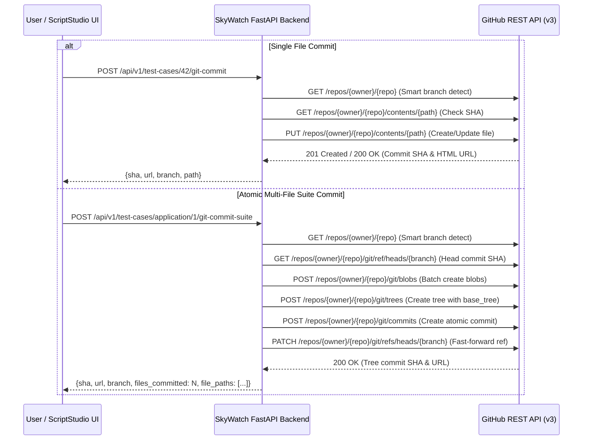

# SkyWatch GitHub REST API Git Integration Guide

SkyWatch 2.4+ provides direct GitHub REST API integration for committing generated test automation scripts (Playwright, Cypress, Selenium Python, Robot Framework, Java TestNG, Jest + Puppeteer) to remote Git repositories.

---

## 1. Architecture Overview

SkyWatch supports two modes of script export:
1. **Local Filesystem Write (Legacy Compatibility)**: `POST /api/v1/test-cases/{id}/git-push` writes to `tests/generated/` locally.
2. **Remote GitHub REST API Commit**: `POST /api/v1/test-cases/{id}/git-commit` commits directly to GitHub via API with authenticated credentials.



---

## 2. Token Configuration & Separation of Concerns

SkyWatch strictly separates tokens to prevent permission escalation and credential leaks:

| Environment Variable | Purpose | Scope / Permissions Required |
|:---|:---|:---|
| `GITHUB_TOKEN` | GitHub Copilot / LLM provider inference | Model inference access |
| `GITHUB_GIT_TOKEN` | Remote Git repository commits & branches | `repo` (classic) or `Contents: Read and write` (fine-grained) |

> [!IMPORTANT]
> Never reuse your LLM provider token for Git operations. As verified in SkyWatch contract tests, `GITHUB_TOKEN` is reserved exclusively for the AI Client. Use `GITHUB_GIT_TOKEN` for Git operations.

### Recommended Token Permissions (Fine-Grained Personal Access Token)

1. Navigate to **GitHub Settings → Developer Settings → Personal Access Tokens → Fine-grained tokens**.
2. Set repository access to: **Selected repositories** (choose your test repositories).
3. Set permissions:
   - **Contents**: `Read and write` (to commit files and read tree)
   - **Metadata**: `Read-only` (automatically included)
   - **Pull requests**: `Read and write` (optional, for future PR creation)
4. Copy the token and configure in your environment.

---

## 3. Environment Configuration

Add the following variables to `backend/.env` (or environment secrets):

```bash
# Dedicated personal access token for Git repository operations (repo scope)
GITHUB_GIT_TOKEN=github_pat_11A...xyz

# Default repository in owner/repo format
GITHUB_GIT_REPO=my-org/e2e-automation

# Default branch (leave empty for smart auto-resolution to default branch)
GITHUB_GIT_BRANCH=

# Base directory path within repository where generated test scripts are committed
GITHUB_GIT_BASE_PATH=tests/skywatch/

# Enable or disable remote Git push operations
ENABLE_GIT_PUSH=true
```

---

## 4. Smart Branch Resolution Strategy

When committing scripts via API or the UI, SkyWatch evaluates branch selection in the following strict priority order:

1. **Explicit branch parameter**: If provided in the API request body (`{ "branch": "feature/login-tests" }`) or the ScriptStudio UI input.
2. **Environment branch**: If `GITHUB_GIT_BRANCH` is configured in the environment.
3. **Auto-detected default branch**: Queries GitHub API (`GET /repos/{owner}/{repo}`) to inspect the repository's configured default branch (typically `main` or `master`).
4. **Fallback branch**: Defaults to `skywatch/generated-tests`.

### Automatic Branch Creation

If the target branch does not exist in the remote repository, SkyWatch automatically:
1. Resolves the repository's default branch.
2. Fetches the latest commit SHA of the default branch.
3. Creates the new branch via `POST /repos/{owner}/{repo}/git/refs`.
4. Commits the generated test scripts to the newly created branch.

---

## 5. API Endpoints Reference

### 1. Test Git Connection
`POST /api/v1/integrations/git/test-connection`

Verifies that `GITHUB_GIT_TOKEN` is valid and has read/write permissions to the repository.

**Request Body:**
```json
{
  "repo": "my-org/e2e-automation"
}
```

**Response (200 OK):**
```json
{
  "success": true,
  "message": "Connected to my-org/e2e-automation",
  "provider": "github",
  "repo": "my-org/e2e-automation",
  "default_branch": "main",
  "permissions": {
    "admin": true,
    "push": true,
    "pull": true
  }
}
```

### 2. List Accessible Repositories
`GET /api/v1/integrations/git/repos?page=1&per_page=30`

Lists repositories accessible to the configured token.

**Response (200 OK):**
```json
{
  "total": 12,
  "page": 1,
  "per_page": 30,
  "repos": [
    {
      "full_name": "my-org/e2e-automation",
      "default_branch": "main",
      "private": true,
      "html_url": "https://github.com/my-org/e2e-automation",
      "description": "Enterprise test suite"
    }
  ]
}
```

### 3. Commit Single Test Case Script
`POST /api/v1/test-cases/{test_case_id}/git-commit`

Generates the test script in the requested framework and commits it as a single file.

**Request Body:**
```json
{
  "framework": "cypress",
  "branch": "main",
  "base_path": "tests/cypress/e2e/",
  "commit_message": "test(checkout): add customer checkout flow test"
}
```

**Response (201 Created):**
```json
{
  "sha": "7b8f9a2c3d4e5f6a1b2c3d4e5f6a7b8c9d0e1f2a",
  "url": "https://github.com/my-org/e2e-automation/commit/7b8f9a2",
  "branch": "main",
  "path": "tests/cypress/e2e/customer_checkout_flow.cy.js",
  "filename": "customer_checkout_flow.cy.js",
  "framework": "cypress",
  "repo": "my-org/e2e-automation"
}
```

### 4. Atomic Multi-File Suite Commit
`POST /api/v1/test-cases/application/{application_id}/git-commit-suite`

Compiles all test cases for an application and commits the entire suite atomically using the GitHub Git Trees API.

**Request Body:**
```json
{
  "framework": "playwright",
  "branch": "skywatch/automated-suite",
  "base_path": "tests/e2e/",
  "commit_message": "test(suite): generate Playwright suite for Apollo Retail"
}
```

**Response (201 Created):**
```json
{
  "sha": "9e8d7c6b5a4f3e2d1c0b9a8f7e6d5c4b3a2f1e0d",
  "url": "https://github.com/my-org/e2e-automation/commit/9e8d7c6",
  "branch": "skywatch/automated-suite",
  "files_committed": 24,
  "file_paths": [
    "tests/e2e/login_flow.spec.ts",
    "tests/e2e/checkout_flow.spec.ts"
  ],
  "framework": "playwright",
  "repo": "my-org/e2e-automation"
}
```

---

## 6. UI Workflows

### Script Studio (Modal)
- Accessible from the **Cases Table** (`⚡ Scripts`), the **Test Case Editor** (`⚡ Script Studio`), and the **Cases Toolbar** (`⚡ Script Studio`).
- Supports live framework switching between all 6 frameworks.
- Click **Commit to GitHub** to expand the commit configuration drawer:
  - Branch input (auto-detection enabled by default).
  - Custom base path input.
  - Custom commit message input.
  - Instant SHA link to the commit on GitHub.

### Settings Studio (Integrations Tab)
- Navigate to **Settings → Enterprise Integrations**.
- The **Git Repository Integration (GitHub REST API)** card allows:
  - Testing token and repository connectivity with permission verification.
  - Browsing all accessible repositories and selecting a target repository with 1 click.
  - Viewing the detected default branch and permission scopes.
