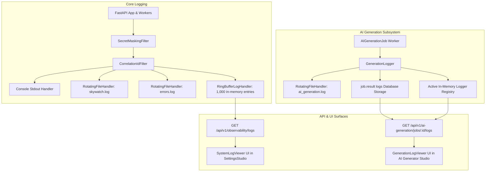

# SkyWatch Logging & Generation Observability Subsystem

> Complete reference for structured logging, persistent AI generation audit trails, rotating file handlers, security redaction, and real-time observability consoles.

---

## 1. Architectural Overview

SkyWatch features an enterprise logging subsystem designed for production reliability, AI generation auditability, and zero credential leakage.



---

## 2. File Logging & Rotation Policies

All file logs are written to the host directory `backend/logs/` (automatically created on startup and git-ignored).

| File Path | Description | Max File Size | Backup Count | Filter / Level |
|---|---|---|---|---|
| `backend/logs/skywatch.log` | General application logs, HTTP transactions, worker jobs | 5 MB | 5 | `INFO` + Secret Redaction |
| `backend/logs/ai_generation.log` | Granular AI generation steps, prompts, tokens, rate limits | 10 MB | 5 | Dedicated `skywatch.ai_generation` |
| `backend/logs/errors.log` | Unhandled exceptions, 500 errors, and system warnings | 5 MB | 5 | `ERROR` and `CRITICAL` only |

---

## 3. Security & Secret Redaction Policy

All logs emitted to console, files, or API endpoints pass through the `SecretMaskingFilter` in `app/core/logging.py`. Sensitive data is replaced with `***REDACTED***` before leaving memory:

- **Google Gemini API Keys**: `AIza...`, `AQ....`
- **OpenAI / Anthropic Secret Keys**: `sk-...`
- **GitHub Personal Access Tokens**: `ghp_...`
- **HTTP Authorization**: `Bearer <token>`
- **Passwords & Connection Strings**: `{"password": "***REDACTED***"}`, `password=***REDACTED***`

---

## 4. AI Generation Job Logging

### Lifecycle Event Capture
Every `AIGenerationJob` is wrapped by a dedicated `GenerationLogger` instance (`app/services/generation_logger.py`):
1. **Intake Stage**: Extracted requirements count, file sizes, character volume, vector chunks indexed.
2. **Discovery Stage**: Target endpoint reachability, HTTP status, interactive controls count, form fields.
3. **Planner Stage**: Blueprint counts, model selection, reasoning latency, token budget.
4. **Generator Stage**: Batched LLM calls, step generation speed, locator synthesis, rate-limit backoff warnings (e.g. 429 retries with seconds remaining).
5. **Validation Stage**: Playwright assertion syntax checks, deduplication stats, test case database IDs.
6. **Completion / Failure**: Full duration in milliseconds, case counts, or structured error diagnosis with stack traces.

### Real-Time In-Memory Registry
While a generation job is active, logs are accessible in sub-millisecond real-time via `get_active_generation_logger(job_id)`. When the job completes or fails, all logs are permanently serialized into `job.result["logs"]`.

---

## 5. REST API Endpoints

### 1. Generation Job Logs
```http
GET /api/v1/ai-generation/jobs/{job_id}/logs?format=json&level=all
Authorization: Bearer <token>
```

**Parameters**:
- `format`: `json` (default) or `text` (plain-text terminal output).
- `level`: `all` (default), `info`, `step`, `llm`, `warn`, `error`.

**Response (JSON)**:
```json
{
  "job_id": "c1f7a188-5182-4161-a080-60ea8d3b85f0",
  "status": "completed",
  "phase": "completed",
  "total_entries": 6,
  "logs": [
    {
      "job_id": "c1f7a188-...",
      "stage": "document_analysis",
      "level": "INFO",
      "message": "AI Generation job started for application 'E-Commerce' (target: https://demo.playwright.dev)",
      "metadata": { "provider": "gemini", "model": "gemini-flash-latest" },
      "timestamp": 1726786800.12,
      "iso_time": "2026-09-19T23:00:00.120Z"
    }
  ]
}
```

### 2. System Runtime Logs
```http
GET /api/v1/observability/logs?limit=100&level=INFO&search=gemini
Authorization: Bearer <token>
```

**Parameters**:
- `limit`: Integer (1 to 500, default 100).
- `level`: `DEBUG`, `INFO`, `WARNING`, `ERROR`.
- `search`: Keyword search for message text or logger names.
- `since`: Optional Unix epoch timestamp to retrieve only new events.

---

## 6. Frontend UI Consoles

### `GenerationLogViewer` (`frontend/src/components/GenerationLogViewer.tsx`)
- Integrated directly into the **AI Scenario Studio** (`aiGenerator`).
- Live-tails backend generation logs during active generation.
- Supports level filtering (`ALL`, `INFO`, `STEP`, `LLM`, `WARN`, `ERROR`), search query highlight, clipboard copy, and `.log` file download.

### `SystemLogViewer` (`frontend/src/components/SystemLogViewer.tsx`)
- Integrated under the **"🖥️ System Logs"** tab in `SettingsStudio`.
- Provides operators and administrators with live-tailing backend logs without requiring SSH or container shell access.
- Live pause/resume controls and dynamic limit selection.
