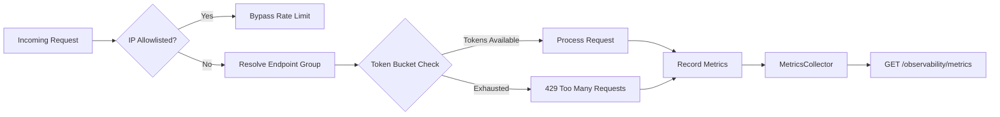

# SkyWatch Observability & Rate Limiting Guide

> Request throttling, metrics collection, and system health monitoring for the SkyWatch platform.

## Architecture



## Rate Limiting

### Token Bucket Algorithm
Each client IP + endpoint group combination gets its own token bucket:
- **Tokens** refill at `requests_per_minute / 60` tokens per second
- **Burst** capacity allows temporary spikes above sustained rate
- When all tokens are consumed, requests receive `429 Too Many Requests`

### Default Rate Limit Rules

| Endpoint Group | Requests/Minute | Burst | Rationale |
|---|---|---|---|
| `/api/v1/auth` | 30 | 10 | Prevent brute-force login attempts |
| `/api/v1/orchestrator` | 10 | 5 | Expensive autonomous campaign operations |
| `/api/v1/ai-generation` | 15 | 5 | LLM-backed operations are costly |
| `/api/v1/observability` | 120 | 20 | Monitoring should be freely accessible |
| `/api/v1/*` (general) | 60 | 15 | Standard API operations |
| `/health` | 300 | 50 | Health checks should never be throttled |

### Configuration

```bash
# Enable/disable rate limiting (default: true)
SKYWATCH_RATE_LIMIT_ENABLED=true
```

### IP Allowlist
The following IPs bypass rate limiting by default:
- `127.0.0.1` (IPv4 loopback)
- `::1` (IPv6 loopback)
- `0.0.0.0`
- `localhost`
- `testclient` (Starlette test client)

### 429 Response Headers
When rate limited, responses include standard headers:

| Header | Description |
|---|---|
| `Retry-After` | Seconds until the client can retry |
| `X-RateLimit-Limit` | Maximum burst capacity for this group |
| `X-RateLimit-Remaining` | Remaining tokens in the bucket |
| `X-RateLimit-Reset` | Seconds until bucket refills |

### Response Body
```json
{
  "detail": "Rate limit exceeded. Please retry after the specified interval.",
  "retry_after_seconds": 5,
  "rate_limit_group": "orchestrator"
}
```

## Observability Metrics

### Metrics Endpoint
```
GET /api/v1/observability/metrics
```

**Response:**
```json
{
  "uptime_seconds": 3600.5,
  "total_requests": 12450,
  "rate_limiter_enabled": true,
  "active_buckets": 42,
  "endpoint_groups": {
    "api-general": {
      "total_requests": 8000,
      "successful_requests": 7800,
      "error_requests": 50,
      "rate_limited_requests": 15,
      "avg_latency_ms": 45.2,
      "min_latency_ms": 2.1,
      "max_latency_ms": 2500.0,
      "error_rate_pct": 0.63,
      "status_codes": { "200": 7800, "404": 135, "500": 50, "429": 15 }
    }
  }
}
```

### Deep Health Check
```
GET /api/v1/observability/health
```

**Response:**
```json
{
  "status": "healthy",
  "version": "2.1.0",
  "environment": "development",
  "checks": {
    "database": { "status": "healthy", "latency_ms": 1.2 },
    "llm_providers": {
      "status": "healthy",
      "total_providers": 6,
      "configured_count": 2,
      "active_provider": "gemini",
      "configured_names": ["Google Gemini", "GitHub Copilot"]
    },
    "rate_limiter": {
      "status": "enabled",
      "active_buckets": 42,
      "groups_configured": 6
    }
  }
}
```

## Metrics Collected Per Endpoint Group

| Metric | Description |
|---|---|
| `total_requests` | Total requests processed |
| `successful_requests` | Requests with 2xx/3xx status |
| `error_requests` | Requests with 5xx status |
| `rate_limited_requests` | Requests blocked with 429 |
| `avg_latency_ms` | Average response time |
| `min_latency_ms` | Fastest response time |
| `max_latency_ms` | Slowest response time |
| `error_rate_pct` | Percentage of 5xx responses |
| `status_codes` | Breakdown by HTTP status code |

## Stale Bucket Cleanup
Token buckets for inactive clients are automatically eligible for cleanup after 1 hour of inactivity. The `cleanup_stale_buckets()` method can be called periodically to reclaim memory.
