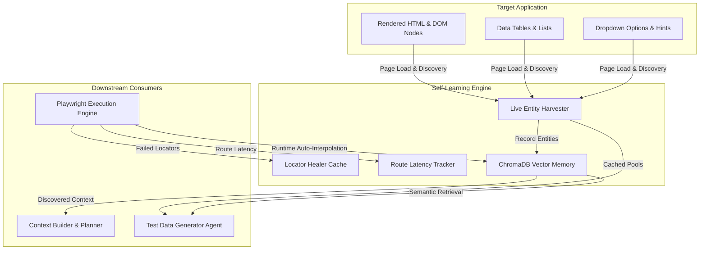

# Self-Learning & Adaptive Entity Engine

**Component Key:** `self_learning_engine`  
**Runtime Ownership:** `backend/app/services/self_learning.py`  
**Storage Backing:** ChromaDB Vector Storage (`backend/vector_store/`) & In-Memory Application Caches  
**Classification:** Continuous Adaptive Quality Learning Subsystem

---

## 1. Executive Summary

The **Self-Learning Engine** provides continuous adaptive feedback loops across the entire testing lifecycle:
1. **Live Entity Harvesting:** Automatically scans target application pages, DOM tables, input hints, and exploratory routes to extract real entities (`owner_name`, `pet_name`, `barcode`, `order_id`, `status`).
2. **Dedicated Test Data Memory:** Stores discovered entities in persistent ChromaDB collections (`app_{id}_test_data_memory`) with FastEmbed semantic embeddings.
3. **Locator Self-Healing & Drift Adaptation:** Records successful healed locators from the Playwright Test Healer, persisting verified selectors to `TestCaseAutomation` records.
4. **Route Performance Baselines:** Tracks URL navigation latencies to establish dynamic timeout thresholds and detect performance regressions.

---

## 2. Adaptive Learning Architecture



---

## 3. Core Engine Interfaces

### 3.1 Entity Harvesting & Retrieval

```python
from app.services.self_learning import SelfLearningEngine

learner = SelfLearningEngine(application_id=1)

# Harvest entities from unstructured text / page snapshot
learner.harvest_page_entities(rendered_page_text)

# Record explicit entity lists
learner.record_discovered_entities("barcode", ["1234567890", "9876543210"])

# Retrieve pool of discovered entities
barcodes = learner.get_discovered_entities("barcode", limit=10)
```

### 3.2 Telemetry & Metrics

```python
metrics = SelfLearningEngine.get_telemetry_metrics(application_id=1)
# Returns:
# {
#   "successful_heals_count": 5,
#   "discovered_entities_count": 42,
#   "routes_tracked_count": 8,
#   "last_learned_at": "2026-09-08T23:55:00Z"
# }
```

---

## 4. Playwright Execution Auto-Resolution

During test execution in `backend/app/services/test_execution.py`:
- `_lookup_parameter(name, parameters, application_id)` checks user-provided parameters first.
- If missing, it queries `SelfLearningEngine(application_id).get_discovered_entities(name)`.
- Replaces tokens like `{{owner_name}}` and `<barcode>` with real, functioning application entities.
