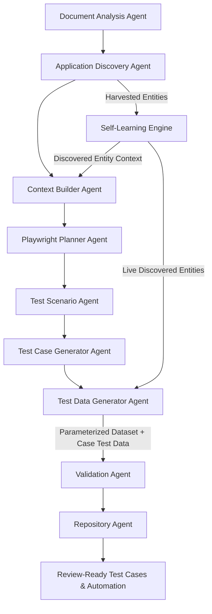

# Test Data Generator Agent

**Agent Key:** `test_data_generator`  
**Definition Source:** `.github/agents/test-data-generator.agent.md`  
**Runtime Ownership:** `backend/app/services/test_data_generator.py`  
**Classification:** Hybrid AI-Driven & Deterministic Adaptive Synthesis Agent

---

## 1. Executive Summary

The **Test Data Generator Agent** is a first-class cognitive agent in the AI-QA-Engine multi-agent framework. Its core responsibility is designing and synthesizing realistic, type-safe, privacy-compliant, and scenario-balanced test datasets.

Rather than relying on static dummy strings (which cause validation errors, search misses, and brittle executions), the Test Data Generator Agent interfaces directly with:
1. **Live Discovered Application Entities:** Harvested in real time by the `SelfLearningEngine` from live DOM tables, dropdowns, input hints, and exploratory routes.
2. **AI Provider Synthesis:** Structured LLM prompting targeting specific boundary conditions, invalid formats, and domain-specific entities.
3. **Deterministic Adaptive Fallback:** Built-in domain schemas ensuring reliable, air-gapped dataset generation even without external LLM availability.

---

## 2. Agent Stage in Multi-Agent Pipeline

The Test Data Generator Agent operates as Stage 7 in the 9-stage durable generation workflow:



---

## 3. Scenario Taxonomy & Coverage Matrix

For every generated dataset profile, the Test Data Generator Agent balances coverage across four primary scenario vectors:

| Scenario Vector | Purpose | Examples |
| :--- | :--- | :--- |
| **Valid** | High-confidence happy-path test execution using real discovered domain values. | Existing owner names, valid pet species, active barcodes, formatted phone numbers. |
| **Invalid** | Validation error checking and schema violation assertions. | Malformed emails (`missing@domain`), non-numeric phone numbers, empty required fields. |
| **Boundary** | Extreme min/max limits, zero-values, and length limits. | 1-character strings, 255-character maximum strings, leap-year dates, $0.00 pricing. |
| **Edge & Security** | Resilience against injection, encoding anomalies, and whitespace issues. | Leading/trailing spaces, unicode accents, SQL escape tokens (`O'Connor`), script tags. |

---

## 4. Architectural Integration & Contracts

### 4.1 Backend Service Interface (`TestDataGeneratorService`)

```python
from app.services.test_data_generator import TestDataGeneratorService

data_generator = TestDataGeneratorService(application_id=1)
dataset_rows = await data_generator.generate_dataset(
    dataset_name="Vaccine Certificate Test Matrix",
    field_names=["owner_name", "pet_name", "barcode", "vaccert_number", "status"],
    scenario_types=["valid", "invalid", "boundary", "edge"],
    row_count=10,
    provider="openai",
    model="gpt-4o",
)
```

### 4.2 REST API Endpoints

- `POST /api/v1/test-data/generate/{application_id}`: Synthesizes a new smart dataset with configurable scenario weights and saves to `TestDataset`.
- `GET /api/v1/test-data/learned/{application_id}`: Returns all live harvested entity pools for the target application.

### 4.3 Runtime Parameter Auto-Interpolation & Dynamic Agent Resolution

During Playwright test execution (`execute_web_target`), all input values are completely dynamic and agent-governed:
1. **User Runtime Parameters:** Explicit values supplied in the execution profile.
2. **Live Application Entity Memory:** Automatically harvested values discovered from application DOM tables, dropdowns, and exploratory routes (`SelfLearningEngine.get_discovered_entities()`).
3. **Dynamic Agent Synthesis Fallback:** If a template parameter (e.g. `{{owner_name}}`, `{{barcode}}`, `{{pet_name}}`) is not yet in entity memory, `TestDataGeneratorService` dynamically synthesizes a typed realistic value on the fly, ensuring zero test failures due to missing hardcoded constants.
