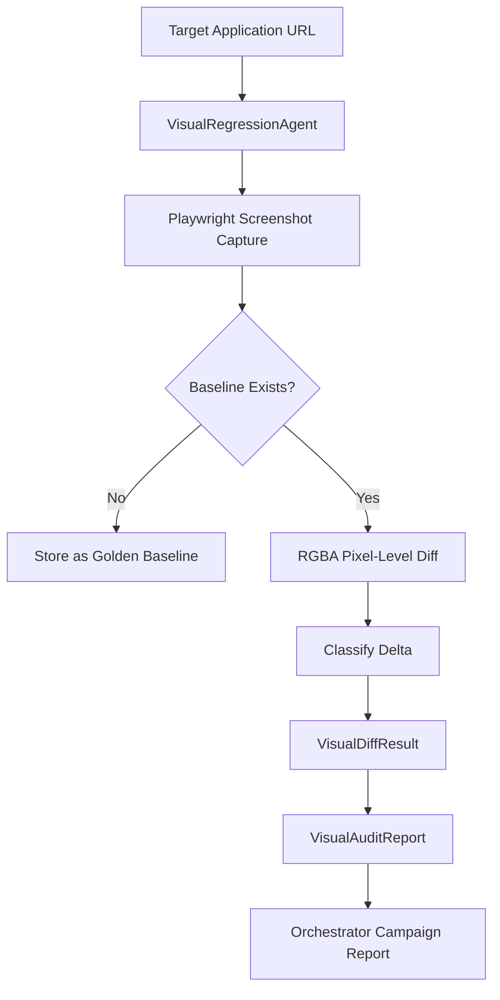

# SkyWatch Visual Regression Engine

> Autonomous screenshot-based visual comparison engine for detecting UI regressions across viewports and routes.

## Architecture



## Visual Diff Classification Taxonomy

| Category | Pixel Diff Range | Description |
|---|---|---|
| `identical` | 0.0% | No visual change detected |
| `cosmetic` | ≤ 0.5% | Sub-pixel anti-aliasing, font rendering, minor color shifts |
| `layout_shift` | ≤ 5.0% | Element repositioning, spacing changes, responsive breakpoints |
| `content_change` | ≤ 15.0% | Text/image content updated but layout intact |
| `regression_break` | > 15.0% | Significant structural or visual breakage |

## Baseline Management

### Storage
Baselines are stored as PNG files in the configured directory (default: `.visual_baselines/`), keyed by `{app_id}_{route}_{viewport}.png`.

Configure via environment variable:
```bash
SKYWATCH_VISUAL_BASELINES_DIR=.visual_baselines
```

### First Run Behavior
On the first audit for a route+viewport combination, the current screenshot is automatically saved as the golden baseline. Subsequent runs compare against this baseline.

## Multi-Viewport Matrix

Default viewports:

| Name | Width × Height | Use Case |
|---|---|---|
| Desktop | 1920 × 1080 | Standard desktop monitors |
| Tablet | 768 × 1024 | iPad and tablet layouts |
| Mobile | 375 × 812 | iPhone/Android phone layouts |

Custom viewports can be configured per audit via the API.

## API Endpoints

### On-Demand Visual Audit
```
POST /api/v1/orchestrator/visual-audit
```

**Request Body:**
```json
{
  "application_id": 1,
  "target_url": "https://app.example.com",
  "viewports": ["1920x1080", "768x1024", "375x812"]
}
```

**Response:**
```json
{
  "app_id": 1,
  "total_comparisons": 3,
  "identical": 2,
  "cosmetic": 1,
  "layout_shifts": 0,
  "content_changes": 0,
  "regressions": 0,
  "results": [...],
  "duration_seconds": 5.23
}
```

### Campaign Integration
Enable visual regression in campaign launches:
```json
{
  "application_id": 1,
  "target_url": "https://app.example.com",
  "visual_regression_enabled": true
}
```

## Pixel Diffing Algorithm

1. **PNG Decoding**: Raw zlib decompression of IDAT chunks to extract RGBA pixel arrays
2. **Per-Pixel Comparison**: Channel-level delta with configurable tolerance (default: 30/255)
3. **Region Detection**: Groups consecutive changed pixels into spatial "changed regions"
4. **Classification**: Maps aggregate pixel diff percentage to the taxonomy above

## Integration with Orchestrator

When `visual_regression_enabled=true` in a campaign, the visual audit runs as **Phase 4** between test execution and report generation. Results appear in the campaign report under the `visual_regression` key.
